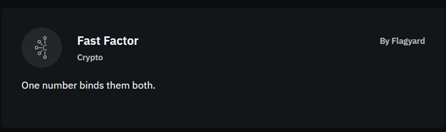
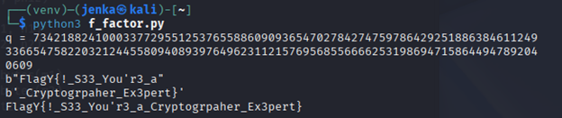
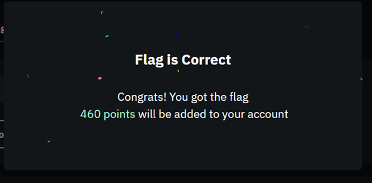
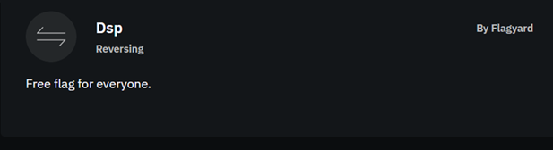
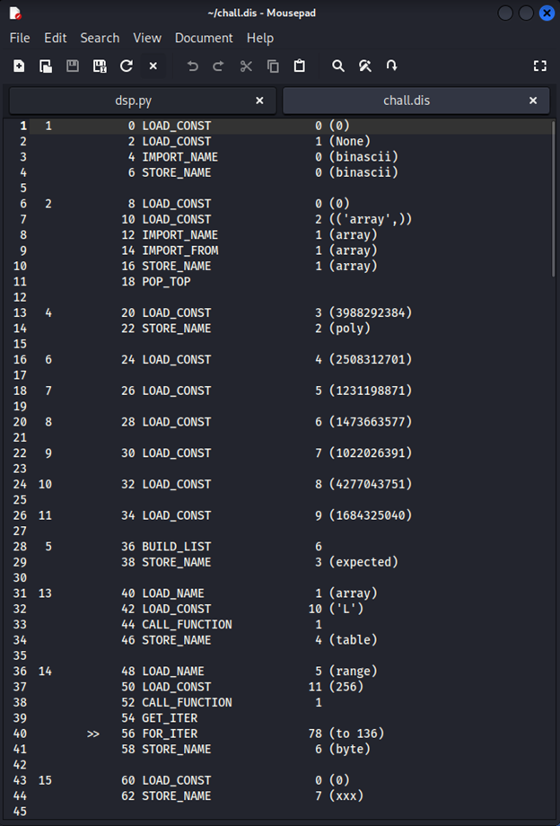
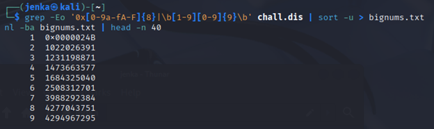
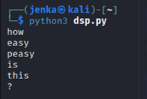
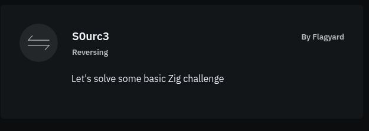
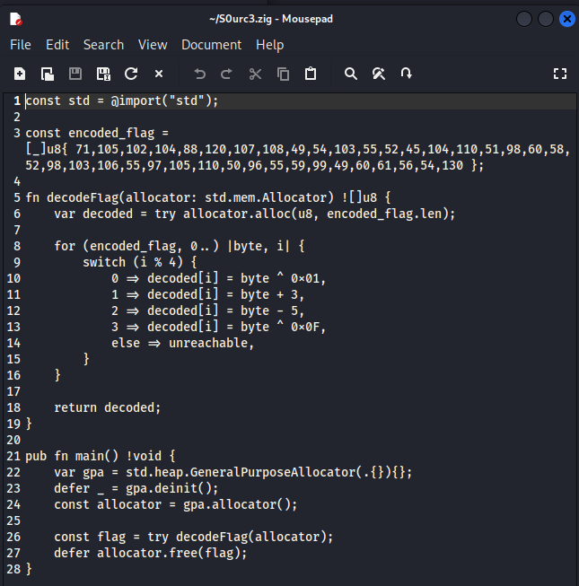
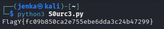

[POC CTF 2025](https://flagyard.com/events/65fb235d-0944-42cc-b46e-f6247b2d9e31)

---

***Fast Factor***
---

Задача на криптографию:



К задаче прикреплены 2 файла со следующим содержанием:

output.txt

```
n1 = 82053248818680507989216448836196335541272251740905031123743673325219481988417967222308115306936687327811648988999814663712868191532876399203193834208808250705843515668132644625967354159372486478776047928358381571198773168252070726400613854290722461612443642992198818623506173395998094817108424714263289305881

c1 = 56661676848927169735110776491937909824284290413832863311986900876753600653037957983196580475032427419853586251161519387882274461078744563890222049895728369816653543594923585900926572918141150311111784831588404480539008516378229582272381455827249401654969062720550480629486243058817654661970637227622726859247

c2 = 30983580665229799654367688627136055519545028462638038067302397076330225890808871678256338205784566625463263822029692821046641584315094997280107595956820216060275732968062101230133479436963515271256827525791412766419540454087843359250731193454751740131696688131617364467446853291522272201828225758634882079972

x = 43632839588972874013601961584034246707680865301377019151236629522106877287680018823110512477643803210756884517629638237603964160273365277698132505025934018680952231934106916831027384433862004200128960373176271465084259610173085142613838766483670575659220101455849928781726818704518005316367197365199436926785486877824237659503457961298116707741896685319202572243103765472089134639820786817038246283892492034447719684012952454182305536456243156007443512348429554185349628893861600626102071462044120244024540713417511281913840009330090354119032634494038798004543268086081589062148719448794389299716444689023261700352494621860016882869434338286894267426480023858636692863160288395758100250935106293146358188063252362437173354879134451076173593323556879095023410700000257837414232260989677018275880338091767524622637021201217513928934990510765609686752291182528347640278154547698375458783926364678747177563785881000114549583161324569830213497370325933265727389934447828006873360057450790843209802298033691090777917082821883208243838720788023651786974077017081209318583322847053929439619839008902021800022511560393344521749686072511666217217211832781383961696107292802294760362485879078148207278101489896962136569805795840706355791731256524470560589169234635961587534275231397013620013120573670000609563890412041516669272795836765953899344810506423037780195986181674915476136916114053516270680974189173262823987764587557034256792490818625960045629585817280077941791614379949089159389693643814010841244129667051307010778890882161823927556706586678524330498566342184357894290382244351261583027515274853812133321137588241410065977573944717085171048348763839297343727229399327503746306587549322904828098739418232644226389622406510736169247766093524150263216047374616877377552337939013222075106946825960857741471012783806540595430409082946308993465264310731935467406646297000687284605261067079149425553983775982153016933548297417811989366161319593723645668219852395104209295712914171572075026512678080428197783193983860139852040375516945813128368348167483979918954142871067276434722838797079090894634139618774649188706839582713940091503866334099141970014255473516938159510170803339749264621767338979136062814025587919859879019130364923779648590034191528247173315594718237731246467446167225356990279551966830791827876162285132184085644710639345640536972403747158046419465438441194708090035260344706702428729633247474470002266126067386153948582598486598940738798869060912576800506765638537249717186778786287732782876520922652194641622124250563257981932047670209907584117129190241346059770973865002476907493123947162872384939596945414697416192153432926537527178743034757554168012547437093312091206151235092358903332985469612695749766436237056794333007454206602691335153073471539875904223436603509984119999929579526596188962512002625171162171427627757015642688523169687224737387811562856553179269127896616928412671514551753811830042287771520494096012926503622913882649811550750247742044553317765968903376373659488437017680400767237789386104338261716888808164499934792195202955699152974836933897832336074863221141392778666843152234966826352633774636064334718772448072292524001994374619132360478488132759575738241789662498153224250401487538581441040178567065769557310242139783848134638003052006362371898068448070845282571465673699597224792162258371821425034977206988295465630483269752803943582690831948242338313482976654893947244185919342427806664140453894718987907803558867495374591349860040259301334551564536126733811926378697135812393679963

e = 0x10001
```

server.py

```python
from Crypto.Util.number import bytes_to_long, getPrime
from os import urandom
import os

os.environ["FLAG1"] = "FAKE_FLAG"
os.environ["FLAG2"] = "FAKE_FLAG"

f1 = os.getenv("FLAG1", "FAKE_FLAG").encode()
f2 = os.getenv("FLAG2", "FAKE_FLAG").encode()
p,q,z = [getPrime(512) for _ in range(3)]
e = 0x10001
E = bytes_to_long(urandom(1337))
n1,n2 = p*q, q*z
c1,c2 = pow(bytes_to_long(f1),e,n1), pow(bytes_to_long(f2),e,n2)

print(f"n1 = {n1}\n")
print(f"c1 = {c1}\n")
print(f"c2 = {c2}\n")
print(f"x = {n1*E+n2}\n")
```

В исходных файлах видно, что сервер генерирует три простых `𝑝`, `𝑞`, `𝑧` и делает два модуля `𝑛1 = 𝑝𝑞` и `𝑛2 = 𝑞𝑧` с общей простотой `𝑞`, шифруя обе половины флага одной экспонентой `𝑒 = 0x10001`. Он также печатает `𝑥 = 𝑛1𝐸 + 𝑛2 `, откуда получается равенство по модулю `𝑥 ≡ 𝑛2 (mod 𝑛1)`. Поэтому мы берём `𝑞 = gcd(𝑛1, 𝑥)`, восстанавливаем `𝑛2 = 𝑥 (mod 𝑛1)`, получаем `𝑝 = 𝑛1/𝑞` и `𝑧 = 𝑛2/𝑞`, считаем `𝜑(𝑛1) = (𝑝 − 1)(𝑞 − 1)` и `𝜑(𝑛2) = (𝑞 − 1)(𝑧 − 1)` , находим приватные `𝑑1` , `𝑑2 = 𝑒^(− 1)(mod 𝜑)` и расшифровываем `𝑐1`,  `𝑐2`. Склеиваем байты двух расшифровок и получаем флаг.

Код программы для решения задачи ниже:

```python
from math import gcd 
from Crypto.Util.number import long_to_bytes

n1 = int(82053248818680507989216448836196335541272251740905031123743673325219481988417967222308115306936687327811648988999814663712868191532876399203193834208808250705843515668132644625967354159372486478776047928358381571198773168252070726400613854290722461612443642992198818623506173395998094817108424714263289305881)
c1 = int(56661676848927169735110776491937909824284290413832863311986900876753600653037957983196580475032427419853586251161519387882274461078744563890222049895728369816653543594923585900926572918141150311111784831588404480539008516378229582272381455827249401654969062720550480629486243058817654661970637227622726859247)
c2 = int(30983580665229799654367688627136055519545028462638038067302397076330225890808871678256338205784566625463263822029692821046641584315094997280107595956820216060275732968062101230133479436963515271256827525791412766419540454087843359250731193454751740131696688131617364467446853291522272201828225758634882079972)
x  = int(43632839588972874013601961584034246707680865301377019151236629522106877287680018823110512477643803210756884517629638237603964160273365277698132505025934018680952231934106916831027384433862004200128960373176271465084259610173085142613838766483670575659220101455849928781726818704518005316367197365199436926785486877824237659503457961298116707741896685319202572243103765472089134639820786817038246283892492034447719684012952454182305536456243156007443512348429554185349628893861600626102071462044120244024540713417511281913840009330090354119032634494038798004543268086081589062148719448794389299716444689023261700352494621860016882869434338286894267426480023858636692863160288395758100250935106293146358188063252362437173354879134451076173593323556879095023410700000257837414232260989677018275880338091767524622637021201217513928934990510765609686752291182528347640278154547698375458783926364678747177563785881000114549583161324569830213497370325933265727389934447828006873360057450790843209802298033691090777917082821883208243838720788023651786974077017081209318583322847053929439619839008902021800022511560393344521749686072511666217217211832781383961696107292802294760362485879078148207278101489896962136569805795840706355791731256524470560589169234635961587534275231397013620013120573670000609563890412041516669272795836765953899344810506423037780195986181674915476136916114053516270680974189173262823987764587557034256792490818625960045629585817280077941791614379949089159389693643814010841244129667051307010778890882161823927556706586678524330498566342184357894290382244351261583027515274853812133321137588241410065977573944717085171048348763839297343727229399327503746306587549322904828098739418232644226389622406510736169247766093524150263216047374616877377552337939013222075106946825960857741471012783806540595430409082946308993465264310731935467406646297000687284605261067079149425553983775982153016933548297417811989366161319593723645668219852395104209295712914171572075026512678080428197783193983860139852040375516945813128368348167483979918954142871067276434722838797079090894634139618774649188706839582713940091503866334099141970014255473516938159510170803339749264621767338979136062814025587919859879019130364923779648590034191528247173315594718237731246467446167225356990279551966830791827876162285132184085644710639345640536972403747158046419465438441194708090035260344706702428729633247474470002266126067386153948582598486598940738798869060912576800506765638537249717186778786287732782876520922652194641622124250563257981932047670209907584117129190241346059770973865002476907493123947162872384939596945414697416192153432926537527178743034757554168012547437093312091206151235092358903332985469612695749766436237056794333007454206602691335153073471539875904223436603509984119999929579526596188962512002625171162171427627757015642688523169687224737387811562856553179269127896616928412671514551753811830042287771520494096012926503622913882649811550750247742044553317765968903376373659488437017680400767237789386104338261716888808164499934792195202955699152974836933897832336074863221141392778666843152234966826352633774636064334718772448072292524001994374619132360478488132759575738241789662498153224250401487538581441040178567065769557310242139783848134638003052006362371898068448070845282571465673699597224792162258371821425034977206988295465630483269752803943582690831948242338313482976654893947244185919342427806664140453894718987907803558867495374591349860040259301334551564536126733811926378697135812393679963)

q = gcd(n1, x)
print("q =", q)

n2 = x % n1
assert n2 % q == 0

p = n1 // q
z = n2 // q
assert p * q == n1 and q * z == n2

phi1 = (p - 1) * (q - 1)
phi2 = (q - 1) * (z - 1)

e = 0x10001
d1 = pow(e, -1, phi1)
d2 = pow(e, -1, phi2)

m1 = pow(c1, d1, n1)
m2 = pow(c2, d2, n2)

pt1 = long_to_bytes(m1)
pt2 = long_to_bytes(m2)
flag = pt1 + pt2
print(pt1)
print(pt2)
print(flag.decode(errors="ignore"))
```

Запустим написанную программу.



Проверим полученный флаг.



---

***GameCloud***
---

Задача на WEB:


Чтобы решить задачу, открываем страницу задания (`http://axnvaglzzq-0.playat.flagyard.com`) и получаем ежедневный бонус, чтобы на счету появились баллы. Затем оформляем покупку услуги «admin_access», но вместо целого количества передаём очень маленькое значение в научной записи. Сервер трактует это значение как обычное вещественное число и рассчитывает стоимость практически равной нулю, поэтому услуга считается активированной. В ответе системы появляется перечень выданных услуг, в описании «Developer Console Access» находим строку с флагом `FlagY{b7ab1bc4f5a5bc76756b95bbd7e8b9ec}`.


Проверим полученный флаг.


---

***DSP***
---

Задача на Reversing:



К задаче приложен файл со следующим содержанием:

chall.dis



Из данного файла выпишем все большие числа. Для этого командой ищем по файлу два вида записей: шестнадцатеричные числа вида `0xAAAAAAAA` и десятичные числа из 10 и более цифр. Найденные значения сохраним в файл `bignums.txt` без повторов.



Далее напишем программу, которая читает из `bignums.txt` все найденные ранее числовые значения, для каждой из позиций подбирает слово: сначала пробует небольшой словарь, а если нужного хэша нет — перебирает строки фиксированной длины и алфавита.

```python
import zlib, itertools, string, sys

try:
    pool = {int(s.strip(), 0) & 0xFFFFFFFF
            for s in open("bignums.txt", "r", encoding="utf-8")
            if s.strip()}
except FileNotFoundError:
    sys.exit("нет файла bignums.txt рядом со скриптом")

def crc(b: bytes) -> int:
    return zlib.crc32(b)

lengths = [3, 4, 5, 2, 4, 1]

dict_cands = [
    ["how","who","why","hey","now","low"],
    ["easy","hard","very","cool","good"],
    ["peasy","hello","there","again","world"],
    ["is","to","of","in","on","at","it"],
    ["this","that","here","there","then","when"],
    ["?","!","."],
]

alphas = [string.ascii_lowercase, string.ascii_lowercase, string.ascii_lowercase,
          string.ascii_lowercase, string.ascii_lowercase, "?!."]

found = [None]*6

for i in range(6):
    L = lengths[i]

    for w in dict_cands[i]:
        if len(w) == L and crc(w.encode()) in pool:
            found[i] = w
            pool.remove(crc(w.encode()))
            break
    if found[i] is not None:
        continue

    for tup in itertools.product(alphas[i], repeat=L):
        s = "".join(tup).encode()
        h = crc(s)
        if h in pool:
            found[i] = s.decode()
            pool.remove(h)
            break
    if found[i] is None:
        sys.exit(f"не найдено слово для позиции {i+1} — расширь алфавит/длину/словари")

print("\n".join(found))
```

На выходе получим шесть слов, после чего оформим их в флаг `FlagY{how_easy_peasy_is_this_?}`.



Проверим полученный флаг.


---

***S0urc3***
---

Задача на Reversing:



К задаче приложен файл со следующим содержанием:

S0urc3.zig



Далее напишем программу, которая из файла `S0urc3.zig` извлекает массив `encoded_flag`, для каждого байта по позиции применяет нужное преобразование `(XOR 0x01, +3, −5, XOR 0x0F)` и печатает полученную строку. 

```python
import re, sys, pathlib

path = pathlib.Path("S0urc3.zig")
if not path.exists():
    sys.exit("Нет файла S0urc3.zig рядом со скриптом")

src = path.read_text(encoding="utf-8", errors="ignore")

m = re.search(r"encoded_flag\s*=\s*\[_\]u8\s*\{([^}]*)\}", src, re.S)
if not m:
    sys.exit("Не нашёл encoded_flag в исходнике")

nums = [int(x) for x in re.findall(r"\b\d+\b", m.group(1))]
if not nums:
    sys.exit("Массив пуст. Похоже, он обрезан (есть '...'). Нужен полный файл.")

decoded = bytearray(len(nums))
for i, b in enumerate(nums):
    if i % 4 == 0:
        decoded[i] = b ^ 0x01
    elif i % 4 == 1:
        decoded[i] = (b + 3) & 0xFF
    elif i % 4 == 2:
        decoded[i] = (b - 5) & 0xFF
    else:  # i % 4 == 3
        decoded[i] = b ^ 0x0F

try:
    print(decoded.decode("utf-8"))
except UnicodeDecodeError:
    print(decoded)
    print(decoded.hex())
```

Запустим программу и получим флаг `FlagY{fc09b850ca2e755ebe6dda3c24b47299}`.



Проверим полученный флаг.


