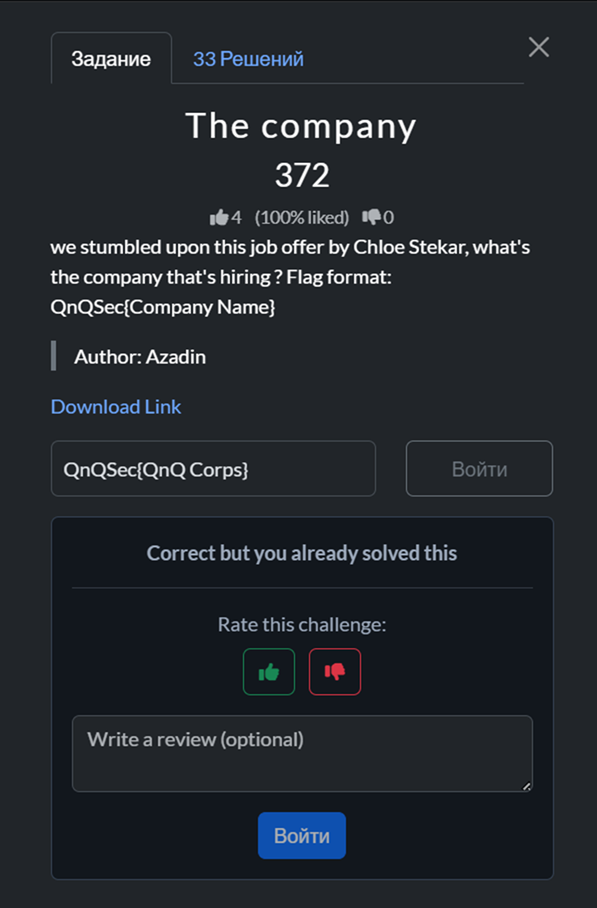

[QnQSec CTF 2025](https://ctf.qnqsec.team/)

---

***The company***
---

Задача на OSINT:


Пробуем поиск по имени Chloe Stekar и находим аккаунт на реддите, где указана компания QnQ Corps.


Пробуем ввести название найденной компании и получаем успех.



---

***Mandatory RSA***
---

Задача на криптографию:


К задаче приложен файл со следующим содержанием:

known.txt

```
n = 30610867131545893573245403370929044810375908252345734515216335567761070674235240557970829245356614030481955825874376565524126172250295479286829004996105122106474627414932278394880727207687247106535964451736524423676062227917939094755601312619938974463767105253817030590414646900543888347805544511989816392901347341338737906837896070023751031260815782973250734600300683094949304509692321753534435264794596296780586539085130232106649876660029506699244567866816756904364396378546670735017278059889632347338673055259053699246622809620909022329749464060132071464884484682112534813343645706384624586841979729464134335809829
e = 13118943056376811531390887158969590633018246393862457649378429529040458860386531667701783962295691727349409639660447099510339788107269491122926716426902195188489126034970976454948883089008820188515413336458510467289740954821973897752400562551402417627328759394493013110177705814518809291916661933709921311243284600780240090861401353930215487292827235572235250164436683130292475464090785626013810206032736933354696930489144983575446495078404329829091193678240029445525658582548485531996972340914370823232033916046942293331266006647674886928834212203547468218609381456317192256524737280398698305720035095438106008915543
c = 18491889164810617543569456750416875989184817880137548014973592642069416208831086398288449741333647958301433206462225905089767171227296166302076329585813204145393998300807912284373441125769784091235480355305999860836226228064817001671079683866140595167104080925862489688205706558563994071054217252661751197090938128540101902284587959897970686920835999487758527543265902558413502613239565915919268373782402562042295965144636399280059309987259722405692758942811072888497222424752062745376152606372092707679048892146955016482797824514120865462676167840311292744307891590740707933408465096337716317714272609074408402855672
```
Даны параметры RSA: `n`, `e`, `c`. Нужно восстановить открытый текст. В тексте задачи есть намёк на маленький приватный показатель: «Size of the D doesn't matter…». Это подталкивает к атаке Винера на малый d.

Для того чтобы решить задачу, напишем программу, которая реализует атаку Винера. Она берёт `e`, `n`, раскладывает дробь `e/n` в цепную дробь и перебирает её сходящиеся (`k`, `d`), для каждого кандидата проверяет, что `(e*d−1)` делится на `k`, чтобы получить целый `φ=(e*d−1)//k`, а затем восстанавливает простые множители модуля решением квадратного уравнения `x(^2)−(n−φ+1)x+n=0` (проверяя, что дискриминант — идеальный квадрат и что найденные `p*q==n`). Как только истинные `p` и `q` найдены, можно считать корректный `d`, выполнить расшифровку `m=pow(c,d,n)` и перевести число `m` в строку.

Код программы приведен ниже:

```python
from math import isqrt

def continued_fraction(n, d):
    while d:
        a = n // d
        yield a
        n, d = d, n - a*d

def convergents(cf):
    num1, num2 = 1, 0
    den1, den2 = 0, 1
    for a in cf:
        num = a*num1 + num2
        den = a*den1 + den2
        yield num, den
        num2, num1 = num1, num
        den2, den1 = den1, den

def wiener(e, n):
    for k, d in convergents(continued_fraction(e, n)):
        if k == 0: 
            continue
        if (e*d - 1) % k != 0:
            continue
        phi = (e*d - 1) // k
        s = n - phi + 1
        disc = s*s - 4*n
        if disc < 0:
            continue
        t = isqrt(disc)
        if t*t != disc:
            continue
        p = (s + t) // 2
        q = (s - t) // 2
        if p*q == n and p>1 and q>1:
            return d, p, q
    return None

n = int(30610867131545893573245403370929044810375908252345734515216335567761070674235240557970829245356614030481955825874376565524126172250295479286829004996105122106474627414932278394880727207687247106535964451736524423676062227917939094755601312619938974463767105253817030590414646900543888347805544511989816392901347341338737906837896070023751031260815782973250734600300683094949304509692321753534435264794596296780586539085130232106649876660029506699244567866816756904364396378546670735017278059889632347338673055259053699246622809620909022329749464060132071464884484682112534813343645706384624586841979729464134335809829)
e = int(13118943056376811531390887158969590633018246393862457649378429529040458860386531667701783962295691727349409639660447099510339788107269491122926716426902195188489126034970976454948883089008820188515413336458510467289740954821973897752400562551402417627328759394493013110177705814518809291916661933709921311243284600780240090861401353930215487292827235572235250164436683130292475464090785626013810206032736933354696930489144983575446495078404329829091193678240029445525658582548485531996972340914370823232033916046942293331266006647674886928834212203547468218609381456317192256524737280398698305720035095438106008915543)
c = int(18491889164810617543569456750416875989184817880137548014973592642069416208831086398288449741333647958301433206462225905089767171227296166302076329585813204145393998300807912284373441125769784091235480355305999860836226228064817001671079683866140595167104080925862489688205706558563994071054217252661751197090938128540101902284587959897970686920835999487758527543265902558413502613239565915919268373782402562042295965144636399280059309987259722405692758942811072888497222424752062745376152606372092707679048892146955016482797824514120865462676167840311292744307891590740707933408465096337716317714272609074408402855672)

res = wiener(e, n)
if not res:
    print("Попробуй boneh-durfee или RsaCtfTool.")
else:
    d, p, q = res
    m = pow(c, d, n)
    try:
        print("plaintext:", bytes.fromhex(hex(m)[2:]).decode())
    except:
        print("plaintext:", hex(m))
```

Запустим написанную программу и получим флаг.


Проверим полученный флаг.


---

***Baby_Reverse_Revenge_From_NHNC***
---

Задача на Reverse:


К задаче приложены два файла: *flag.enc* — зашифрованный флаг, *encrypter* — шифратор/описание алгоритма, из которого можно извлечь параметры шифрования.

Чтобы решить задачу, напишем программу, которая читает из файла *flag.enc* шифротекст и, используя извлечённые из *encrypter* параметры (AES-256-CBC, ключ, дополненный нулями до 32 байт), выполняет расшифрование, снимает паддинг.

Код программы приведен ниже:

```python
# AES-256-CBC: ключ = b"th1_1s_th3_valu3_0f_k3y" (дополнен нулями до 32 байт)
# IV = b"1337" + 12 нулей, padding = PKCS#7

import sys
import os

def _fail_import():
    print(
        "Не найден модуль pycryptodome.\n",
        file=sys.stderr
    )
    sys.exit(1)

try:
    from Crypto.Cipher import AES
    from Crypto.Util.Padding import unpad
except Exception:
    _fail_import()

KEY = b"th1_1s_th3_valu3_0f_k3y".ljust(32, b"\x00") 
IV  = b"1337" + b"\x00" * 12                         

def decrypt_bytes(ciphertext: bytes) -> bytes:
    cipher = AES.new(KEY, AES.MODE_CBC, IV)
    plaintext_padded = cipher.decrypt(ciphertext)
    try:
        return unpad(plaintext_padded, 16)
    except ValueError as e:
        raise ValueError(f"Ошибка распаковки (padding): {e}. "
                         f"Проверьте, что это правильный 'flag.enc' и что он не повреждён.")

def decrypt_file(inp_path: str, out_path: str | None = None) -> bytes:
    if not os.path.exists(inp_path):
        raise FileNotFoundError(f"Файл не найден: {inp_path}")
    with open(inp_path, "rb") as f:
        ct = f.read()
    pt = decrypt_bytes(ct)
    if out_path:
        with open(out_path, "wb") as g:
            g.write(pt)
    return pt

def main():
    inp = sys.argv[1] if len(sys.argv) > 1 else "flag.enc"
    outp = sys.argv[2] if len(sys.argv) > 2 else None

    try:
        pt = decrypt_file(inp, outp)
    except Exception as e:
        print(f"[!] Ошибка: {e}", file=sys.stderr)
        if not os.path.exists(inp):
            print(f"Текущая папка: {os.getcwd()}", file=sys.stderr)
            print("Проверьте имя файла и путь. Если файл рядом со скриптом — используйте просто 'flag.enc'.", file=sys.stderr)
        sys.exit(2)

    if outp:
        print(f"расшифровано в файл: {outp}")
    else:
        try:
            s = pt.decode("utf-8")
            print(s)
        except UnicodeDecodeError:
            print("Данные не похожи на UTF-8 текст. hex-дамп первых 256 байт:")
            print(pt[:256].hex())
            print("Если это бинарный файл, укажите имя выходного файла вторым аргументом, например:")
            print("python3 decrypt_flag.py flag.enc flag.txt")

if __name__ == "__main__":
    main()
```

Запустим написанную программу и получим флаг.


Проверим полученный флаг.


