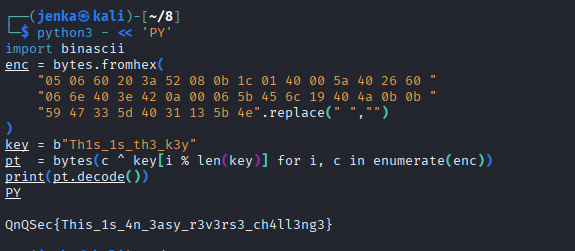
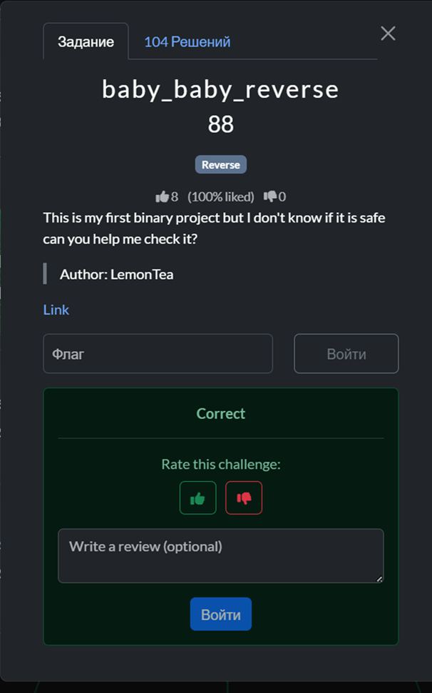

[QnQSec CTF 2025](https://ctf.qnqsec.team/)

---

***The company***
---

Задача на OSINT:


Пробуем поиск по имени Chloe Stekar и находим аккаунт на реддите, где указана компания QnQ Corps.


Пробуем ввести название найденной компании и получаем успех.


---

***Mandatory RSA***
---

Задача на криптографию:


К задаче приложен файл со следующим содержанием:

known.txt

```
n = 30610867131545893573245403370929044810375908252345734515216335567761070674235240557970829245356614030481955825874376565524126172250295479286829004996105122106474627414932278394880727207687247106535964451736524423676062227917939094755601312619938974463767105253817030590414646900543888347805544511989816392901347341338737906837896070023751031260815782973250734600300683094949304509692321753534435264794596296780586539085130232106649876660029506699244567866816756904364396378546670735017278059889632347338673055259053699246622809620909022329749464060132071464884484682112534813343645706384624586841979729464134335809829
e = 13118943056376811531390887158969590633018246393862457649378429529040458860386531667701783962295691727349409639660447099510339788107269491122926716426902195188489126034970976454948883089008820188515413336458510467289740954821973897752400562551402417627328759394493013110177705814518809291916661933709921311243284600780240090861401353930215487292827235572235250164436683130292475464090785626013810206032736933354696930489144983575446495078404329829091193678240029445525658582548485531996972340914370823232033916046942293331266006647674886928834212203547468218609381456317192256524737280398698305720035095438106008915543
c = 18491889164810617543569456750416875989184817880137548014973592642069416208831086398288449741333647958301433206462225905089767171227296166302076329585813204145393998300807912284373441125769784091235480355305999860836226228064817001671079683866140595167104080925862489688205706558563994071054217252661751197090938128540101902284587959897970686920835999487758527543265902558413502613239565915919268373782402562042295965144636399280059309987259722405692758942811072888497222424752062745376152606372092707679048892146955016482797824514120865462676167840311292744307891590740707933408465096337716317714272609074408402855672
```
Даны параметры RSA: `n`, `e`, `c`. Нужно восстановить открытый текст. В тексте задачи есть намёк на маленький приватный показатель: «Size of the D doesn't matter…». Это подталкивает к атаке Винера на малый d.

Для того чтобы решить задачу, напишем программу, которая реализует атаку Винера. Она берёт `e`, `n`, раскладывает дробь `e/n` в цепную дробь и перебирает её сходящиеся (`k`, `d`), для каждого кандидата проверяет, что `(e*d−1)` делится на `k`, чтобы получить целый `φ=(e*d−1)//k`, а затем восстанавливает простые множители модуля решением квадратного уравнения `x(^2)−(n−φ+1)x+n=0` (проверяя, что дискриминант — идеальный квадрат и что найденные `p*q==n`). Как только истинные `p` и `q` найдены, можно считать корректный `d`, выполнить расшифровку `m=pow(c,d,n)` и перевести число `m` в строку.

Код программы приведен ниже:

```python
from math import isqrt

def continued_fraction(n, d):
    while d:
        a = n // d
        yield a
        n, d = d, n - a*d

def convergents(cf):
    num1, num2 = 1, 0
    den1, den2 = 0, 1
    for a in cf:
        num = a*num1 + num2
        den = a*den1 + den2
        yield num, den
        num2, num1 = num1, num
        den2, den1 = den1, den

def wiener(e, n):
    for k, d in convergents(continued_fraction(e, n)):
        if k == 0: 
            continue
        if (e*d - 1) % k != 0:
            continue
        phi = (e*d - 1) // k
        s = n - phi + 1
        disc = s*s - 4*n
        if disc < 0:
            continue
        t = isqrt(disc)
        if t*t != disc:
            continue
        p = (s + t) // 2
        q = (s - t) // 2
        if p*q == n and p>1 and q>1:
            return d, p, q
    return None

n = int(30610867131545893573245403370929044810375908252345734515216335567761070674235240557970829245356614030481955825874376565524126172250295479286829004996105122106474627414932278394880727207687247106535964451736524423676062227917939094755601312619938974463767105253817030590414646900543888347805544511989816392901347341338737906837896070023751031260815782973250734600300683094949304509692321753534435264794596296780586539085130232106649876660029506699244567866816756904364396378546670735017278059889632347338673055259053699246622809620909022329749464060132071464884484682112534813343645706384624586841979729464134335809829)
e = int(13118943056376811531390887158969590633018246393862457649378429529040458860386531667701783962295691727349409639660447099510339788107269491122926716426902195188489126034970976454948883089008820188515413336458510467289740954821973897752400562551402417627328759394493013110177705814518809291916661933709921311243284600780240090861401353930215487292827235572235250164436683130292475464090785626013810206032736933354696930489144983575446495078404329829091193678240029445525658582548485531996972340914370823232033916046942293331266006647674886928834212203547468218609381456317192256524737280398698305720035095438106008915543)
c = int(18491889164810617543569456750416875989184817880137548014973592642069416208831086398288449741333647958301433206462225905089767171227296166302076329585813204145393998300807912284373441125769784091235480355305999860836226228064817001671079683866140595167104080925862489688205706558563994071054217252661751197090938128540101902284587959897970686920835999487758527543265902558413502613239565915919268373782402562042295965144636399280059309987259722405692758942811072888497222424752062745376152606372092707679048892146955016482797824514120865462676167840311292744307891590740707933408465096337716317714272609074408402855672)

res = wiener(e, n)
if not res:
    print("Попробуй boneh-durfee или RsaCtfTool.")
else:
    d, p, q = res
    m = pow(c, d, n)
    try:
        print("plaintext:", bytes.fromhex(hex(m)[2:]).decode())
    except:
        print("plaintext:", hex(m))
```

Запустим написанную программу и получим флаг.


Проверим полученный флаг.


---

***Baby_Reverse_Revenge_From_NHNC***
---

Задача на Reverse:


К задаче приложены два файла: *flag.enc* — зашифрованный флаг, *encrypter* — шифратор/описание алгоритма, из которого можно извлечь параметры шифрования.

Чтобы решить задачу, напишем программу, которая читает из файла *flag.enc* шифротекст и, используя извлечённые из *encrypter* параметры (AES-256-CBC, ключ, дополненный нулями до 32 байт), выполняет расшифрование, снимает паддинг.

Код программы приведен ниже:

```python
# AES-256-CBC: ключ = b"th1_1s_th3_valu3_0f_k3y" (дополнен нулями до 32 байт)
# IV = b"1337" + 12 нулей, padding = PKCS#7

import sys
import os

def _fail_import():
    print(
        "Не найден модуль pycryptodome.\n",
        file=sys.stderr
    )
    sys.exit(1)

try:
    from Crypto.Cipher import AES
    from Crypto.Util.Padding import unpad
except Exception:
    _fail_import()

KEY = b"th1_1s_th3_valu3_0f_k3y".ljust(32, b"\x00") 
IV  = b"1337" + b"\x00" * 12                         

def decrypt_bytes(ciphertext: bytes) -> bytes:
    cipher = AES.new(KEY, AES.MODE_CBC, IV)
    plaintext_padded = cipher.decrypt(ciphertext)
    try:
        return unpad(plaintext_padded, 16)
    except ValueError as e:
        raise ValueError(f"Ошибка распаковки (padding): {e}. "
                         f"Проверьте, что это правильный 'flag.enc' и что он не повреждён.")

def decrypt_file(inp_path: str, out_path: str | None = None) -> bytes:
    if not os.path.exists(inp_path):
        raise FileNotFoundError(f"Файл не найден: {inp_path}")
    with open(inp_path, "rb") as f:
        ct = f.read()
    pt = decrypt_bytes(ct)
    if out_path:
        with open(out_path, "wb") as g:
            g.write(pt)
    return pt

def main():
    inp = sys.argv[1] if len(sys.argv) > 1 else "flag.enc"
    outp = sys.argv[2] if len(sys.argv) > 2 else None

    try:
        pt = decrypt_file(inp, outp)
    except Exception as e:
        print(f"[!] Ошибка: {e}", file=sys.stderr)
        if not os.path.exists(inp):
            print(f"Текущая папка: {os.getcwd()}", file=sys.stderr)
            print("Проверьте имя файла и путь. Если файл рядом со скриптом — используйте просто 'flag.enc'.", file=sys.stderr)
        sys.exit(2)

    if outp:
        print(f"расшифровано в файл: {outp}")
    else:
        try:
            s = pt.decode("utf-8")
            print(s)
        except UnicodeDecodeError:
            print("Данные не похожи на UTF-8 текст. hex-дамп первых 256 байт:")
            print(pt[:256].hex())
            print("Если это бинарный файл, укажите имя выходного файла вторым аргументом, например:")
            print("python3 decrypt_flag.py flag.enc flag.txt")

if __name__ == "__main__":
    main()
```

Запустим написанную программу и получим флаг.


Проверим полученный флаг.


---

***myLFSR?***
---

Задача на криптографию:


К задаче приложены файлы со следующим содержанием:

chall.py
```python
from secrets import randbits
import os


def expand(n: int, base=3) -> list[int]:
  res = []
  while n:
    res.append(n % base)
    n //= base
  return res


class myLFSR:
  def __init__(self, key: list[int], mask: list[int]):
    assert all(0 <= x < 3 for x in key), "Key must be in range [0, 2]"
    assert all(0 <= x < 3 for x in mask), "Mask must be in range [0, 2]"
    assert len(key) == len(mask), "Key and mask must be of the same length"

    self.state = key
    self.mask = mask
    self.mod = 3

  def __call__(self) -> int:
    b = sum(s * m for s, m in zip(self.state, self.mask)) % self.mod
    output = self.state[0]
    self.state = self.state[1:] + [b]

    return output


class Cipher:
  def __init__(self, key: list[int], mask: list[int]):
    self.lfsr = myLFSR(key, mask)

  def encrypt(self, msg: bytes) -> bytes:
    pt = expand(int.from_bytes(msg, "big"))
    stream = [self.lfsr() for _ in range(len(pt))]
    ct = [a ^ b for a, b in zip(pt, stream)]
    return bytes(ct)


if __name__ == "__main__":
  flag = open("flag.txt", "rb").read().strip()
  KEY = expand(int.from_bytes(os.urandom(8), "big"))
  MASK = [randbits(256) % 3 for _ in range(len(KEY))]
  cipher = Cipher(KEY, MASK)
  gift = cipher.encrypt(b"\xff" * (len(KEY) // 3 + 3))
  ct = cipher.encrypt(flag)
  print(len(KEY))
  print(gift.hex())
  print(ct.hex())
```

output.txt
```
40
020000030303020100010000020302000001000100000301030302000001010301010300000002000301030300000200000301020100030302000000020100000001030100010300020203010103000102
01010002000003000002010000000203030201000000030100030003010103030001020200010301000202000202030302020103030002030100030002020000010200010000010100000200000103010103030302010301010100000000030000020203030300020103010002020100020201000100000000030003010301010101000101010002000203000102020002000000000102030303000000000301010102030002030100010002000203000000010200000000030001030003020303000300000302010303000301020302000003020003030102010102020000030201000103000100
```

*chall.py* — скрипт, формирующий поток над полем GF(3), сначала шифрующий фиксированное сообщение из байтов 0xff (служебный `gift`), затем флаг, и выводящий три строки: длину регистра, шифротекст `gift` и шифротекст флага (в hex).

*output.txt* — соответствующие три строки вывода: число 40, затем hex `gift`, затем hex флага.

Чтобы решить задачу, напишем программу, которая по известному `gift` восстанавливает генератор потока, продолжает поток на длину шифротекста флага и выполняет обратную операцию (покомпонентное сложение по модулю 3) для получения исходных тритов, после чего собирает их в исходные байты и выводит флаг.

Код программы приведен ниже:

```python
from typing import List

def expand(n: int, base: int = 3) -> List[int]:
    res = []
    while n:
        res.append(n % base)
        n //= base
    return res

def bm_gf3(seq: List[int], mod: int = 3):
    C, B = [1], [1]
    L, m, b = 0, 1, 1
    for n, x in enumerate(seq):
        d = x
        for i in range(1, L + 1):
            d = (d + C[i] * seq[n - i]) % mod
        if d == 0:
            m += 1
            continue
        inv_b = 1 if b % 3 == 1 else 2 
        coef = (d * inv_b) % mod
        T = C[:]
        if len(C) < len(B) + m:
            C += [0] * (len(B) + m - len(C))
        for i in range(len(B)):
            C[i + m] = (C[i + m] - coef * B[i]) % mod
        if 2 * L <= n:
            L, B, b, m = n + 1 - L, T, d, 1
        else:
            m += 1
    coeffs = [(-c) % mod for c in C[1 : L + 1]]
    return L, coeffs

def gen_stream(seed: List[int], coeffs: List[int], length: int, mod: int = 3):
    s = seed[:]
    L = len(coeffs)
    while len(s) < length:
        nxt = 0
        for i in range(L):
            nxt = (nxt + coeffs[i] * s[-1 - i]) % mod
        s.append(nxt)
    return s

def collapse_trits(trits: List[int], base: int = 3) -> int:
    n, p = 0, 1
    for d in trits:
        n += d * p
        p *= base
    return n

L = None
gift_hex = None
ct_hex = None
with open("output.txt", "r") as f:
    L = int(f.readline().strip())
    gift_hex = f.readline().strip()
    ct_hex = f.readline().strip()

gift = list(bytes.fromhex(gift_hex))
ct   = list(bytes.fromhex(ct_hex))

msg = bytes([0xFF]) * (L // 3 + 3)  
pt_gift = expand(int.from_bytes(msg, "big"))
assert len(pt_gift) == len(gift)

ks_gift = [a ^ b for a, b in zip(gift, pt_gift)]

order, coeffs = bm_gf3(ks_gift)
assert order == L

stream_full = gen_stream(ks_gift, coeffs, len(gift) + len(ct))
ks_ct = stream_full[len(gift):]

pt_flag = [a ^ b for a, b in zip(ct, ks_ct)]       
N = collapse_trits(pt_flag, 3)
flag = N.to_bytes((N.bit_length() + 7) // 8, "big").decode()

print(flag)
```

Запустим написанную программу и получим флаг.


Проверим полученный флаг.


---

***baby_baby_reverse***
---

Задача на Reverse:


К задаче приложено ELF-приложение main, которое запрашивает строку «Enter flag:» и отвечает «Correct!»/«Wrong!». Нужно восстановить правильный флаг.

Смотрим читаемые строки. В выводе видим «Enter flag:», «Correct!», «Wrong!», а также два фрагмента «Th1s_1s_» и «th3_k3y». Эти строки указывают на фиксированный ключ, которым программа преобразует введённый текст перед проверкой.


Получаем содержимое раздела данных программы с помощью команды `objdump -s -j .data`. Среди выведенных шестнадцатеричных значений находим непрерывную последовательность байтов. Это и есть зашифрованные символы искомого ответа, которые программа сравнивает с результатом преобразования введённой строки.


Записываем найденные байты в скрипт и задакм ключ строкой `Th1s_1s_th3_k3y`. Скрипт последовательно преобразует каждый байт и выводит исходный текст.



Проверяем полученный флаг.



---

***A easy web***
---

Задача на Web:


Открываем указанный сайт. На главной странице видим приветствие и подсказку: нужно получить доступ администратора и прочитать флаг.


Открываем страницу профиля по адресу с параметром uid=1337, подобранным наугад. Страница показывает имя «admin» и роль «admin», а также даёт ссылку в административный раздел. Переходим по ссылке «Go to Admin Panel».


В панели администратора есть поле для ввода команды и кнопка запуска. 


Через это поле смотрим содержимое рабочей папки приложения командой `ls -la /app`. В ответе видим список файлов и папок, среди них скрытый каталог с именем *.hidden*.


Просматриваем скрытый каталог командой `ls -la /app/.hidden`. В выводе появляется текстовый файл, имя которого начинается со слова *flag-*.


Читаем содержимое файла, командой `sed -n 1,200p /app/.hidden/flag-*`. Страница выводит строку с флагом.


Проверяем полученный флаг.


