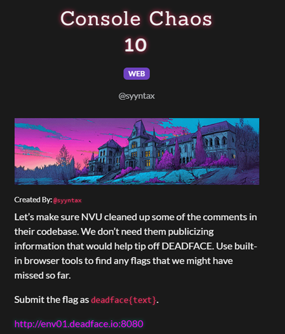

[DEADFACE](https://ctf.deadface.io)

---

***Waff Waff***
---

Задача на OSINT:


К задаче прикреплена фотография:


На фотографии мы можем заметить часть названия улицы. Также по надписям понимаем, что это Германия.


Ищем улицы с таким же началом названия и находим улицу в городе Ротвайль, пробуем его, поскольку на фото изображены игрушечные ротвейлеры.


Город и улица были найдены верно.


---

***Echo Chamber***
---

Задача на PWN:


По описанию замечаем, что «чат-бот эхом» печатает введённое сообщение без санитизации. Поэтому отправляем позиционные спецификаторы в цикле на сервис, чтобы бот, выполнив printf, подставлял строки из разных ячеек стека и возвращал их нам. Таким образом получаем флаг.


Проверим полученный флаг.


---

***Cereal Killer***
---

Задача на REVERSE:


Выполним статический просмотр содержимого бинарного файла, приложенного к задаче. В выводе видим «ChatGPT says: The SPOOKIEST cereal is...» и длинную шестнадцатеричную/зашифрованную последовательность. Декодирвав эту последовательность, получим пароль `peanutbuttercrunch`.


Запустим бинарный файл интерактивно, введем найденный пароль, после чего программа выводит флаг.


Проверим полученный флаг.


---

***Melody Way***
---

Задача на OSINT:


К задаче приложена фотография:


По надписи понимаем, что это Южная Корея, ищем заведение Paris Baguette, которое видно на фото, в похожем на фотографию месте.


Далее заходим в карты и смотрим на здание через дорогу, видим его название.


Проверяем флаг, название здания было найдено верно.


---

***CreepNet***
---

Задача на PCAP:


К задаче приложен файл сетевого трафика. Напишем программу, которая автоматически перебирает пакеты и оставляет только DNS-запросы, из которых извлекает части, похожие на base64, затем декодирует эти части, собирает полученные куски в правильной последовательности и выводит итоговую строку.

```python
import struct, sys, base64, re

def read_pcap(path):
    with open(path, "rb") as f:
        gh = f.read(24)
        magic = gh[:4]
        if magic == b'\xd4\xc3\xb2\xa1': endian = "<"
        elif magic == b'\xa1\xb2\xc3\xd4': endian = ">"
        elif magic == b'\x4d\x3c\xb2\xa1': endian = "<"
        elif magic == b'\xa1\xb2\x3c\x4d': endian = ">"
        else: raise SystemExit("Unknown pcap format")
        while True:
            ph = f.read(16)
            if not ph: break
            ts_sec, ts_usec, incl_len, orig_len = struct.unpack(endian+"IIII", ph)
            data = f.read(incl_len)
            yield ts_sec + ts_usec/1_000_000, data

def ipv4_from_eth(frame):
    if len(frame) < 14: return None
    if struct.unpack("!H", frame[12:14])[0] != 0x0800: return None
    ip = frame[14:]
    if len(ip) < 20: return None
    ihl = (ip[0] & 0xF) * 4
    proto = ip[9]
    return proto, ip[ihl:]

def parse_udp(pkt):
    if len(pkt) < 8: return None
    sport, dport, length, _ = struct.unpack("!HHHH", pkt[:8])
    return sport, dport, pkt[8:8+length-8]

def parse_dns_queries(payload):
    if len(payload) < 12: return []
    qd = struct.unpack("!H", payload[4:6])[0]
    off, res = 12, []
    for _ in range(qd):
        labels = []
        while True:
            if off >= len(payload): break
            l = payload[off]; off += 1
            if l == 0: break
            if (l & 0xC0) == 0xC0:
                off += 1; break
            labels.append(payload[off:off+l].decode("ascii","ignore"))
            off += l
        if off+4 <= len(payload): off += 4
        res.append(".".join(labels))
    return res

def maybe_b64(label):
    s = label.split(".")[0]
    return re.fullmatch(r"[A-Za-z0-9+/_-]{8,}", s) and s

def b64dec(s):
    s = s.replace("-", "+").replace("_", "/")
    pad = "==="[: (4 - len(s)%4) % 4]
    return base64.b64decode(s + pad).decode("latin1")

if __name__ == "__main__":
    path = sys.argv[1] if len(sys.argv)>1 else "creep-log.pcap"
    chunks = []
    for _, data in read_pcap(path):
        v = ipv4_from_eth(data)
        if not v: continue
        proto, l4 = v
        if proto != 17: continue  # UDP only
        u = parse_udp(l4)
        if not u: continue
        sport, dport, dns = u
        if dport != 53: continue
        for q in parse_dns_queries(dns):
            b = maybe_b64(q)
            if b: 
                try: chunks.append(b64dec(b))
                except: pass
    chunks.sort(key=lambda x: (0 if x.startswith("deadface{") else (2 if x.strip().endswith("}") else 1)))
    flag = "".join(chunks).strip()
    print(flag)
```

Запустим написанную программу и получим флаг.


Проверим полученный флаг.


---

***Console Chaos***
---

Задача на WEB:



В браузере напишем скрипт, который автоматически обходит набор URL, подгружает HTML каждой страницы и затем парсит подключённые ресурсы, ищет в тексте все вхождения вида deadface{...}, собирает их в массив и выводит таблицу найденных флагов и список уникальных флагов.

```JavaScript
(async () => {
  const pages = [
    location.href,
    "/?page=announcements",
    "/?page=courses",
    "/?page=news",
    "/?page=research",
    "/?page=login",
  ].map(p => new URL(p, location).href);

  const allFlags = [];
  const getFlags = (txt, url) => {
    const m = txt.match(/deadface\{[^}]+\}/gi);
    if (m) m.forEach(f => allFlags.push({ url, flag: f }));
  };

  for (const url of pages) {
    try {
      const html = await (await fetch(url, { cache: "no-store" })).text();
      getFlags(html, url);

      // плюс подключённые ресурсы (js, css) на этой странице
      const doc = new DOMParser().parseFromString(html, "text/html");
      const assets = [
        ...doc.querySelectorAll('script[src]'),
        ...doc.querySelectorAll('link[rel="stylesheet"][href]')
      ].map(n => new URL(n.getAttribute("src") || n.getAttribute("href"), url).href);

      for (const a of assets) {
        try {
          const t = await (await fetch(a, { cache: "no-store" })).text();
          getFlags(t, a);
        } catch {}
      }
    } catch {}
  }

  console.table(allFlags);
  console.log("Unique flags:", [...new Set(allFlags.map(x => x.flag))]);
})();
```

Выполним скрип и получим флаг.


Проверим полученный флаг.


---

***Pest Control***
---

Задача на WEB:


В консоли браузера запустим скрипт, который перебирает набор предполагаемых API-путей, парсит ответы и ищет в них строки вида deadface{...}. После запуска видим флаг.


Проверим полученный флаг.


---

***Stick to the Script***
---

Задача на WEB:


Из задания понимаем, что флаг нужно искать в скрипте. В Sources находим script.js. В нем видим подозрительную строку, похожую на base64.


Декодируем найденную строку и получаем флаг.


Проверим найденный флаг.


