[V1t CTF 2025](https://ctf.v1t.site)

---

***Lost Some Binary***
---

Задача на Crypto:

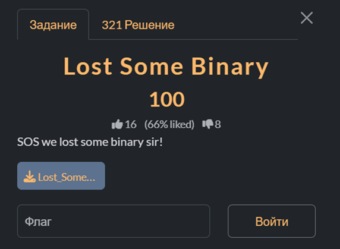

К задаче прикреплен файл со следующим содержимым:

Lost_Some_Binary.txt

```
01001000 01101001 01101001 01101001 00100000 01101101 01100001 01101110 00101100 01101000 01101111 01110111 00100000 01110010 00100000 01110101 00100000 00111111 01001001 01110011 00100000 01101001 01110100 00100000 00111010 00101001 00101001 00101001 00101001 01010010 01100001 01110111 01110010 00101101 01011110 01011110 01011011 01011101 00100000 00100000 01001100 01010011 01000010 01111011 00111110 00111100 01111101 00100001 01001100 01010011 01000010 01111110 01111110 01001100 01010011 01000010 01111110 01111110 00101101 00101101 00101101 01110110 00110001 01110100 00100000 00100000 01111011 00110001 00110011 00110101 00111001 00110000 00110000 01011111 00110001 00110011 00110011 00110111 00110000 01111101
```

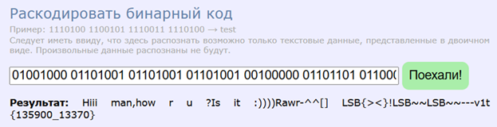

```c++
#include <iostream>
#include <sstream>
#include <string>
#include <algorithm>

int main() {
    const std::string data = R"(01001000 01101001 01101001 01101001 00100000 01101101 01100001 01101110 00101100 01101000 01101111 01110111 00100000 01110010 00100000 01110101 00100000 00111111 01001001 01110011 00100000 01101001 01110100 00100000 00111010 00101001 00101001 00101001 00101001 01010010 01100001 01110111 01110010 00101101 01011110 01011110 01011011 01011101 00100000 00100000 01001100 01010011 01000010 01111011 00111110 00111100 01111101 00100001 01001100 01010011 01000010 01111110 01111110 01001100 01010011 01000010 01111110 01111110 00101101 00101101 00101101 01110110 00110001 01110100 00100000 00100000 01111011 00110001 00110011 00110101 00111001 00110000 00110000 01011111 00110001 00110011 00110011 00110111 00110000 01111101)";

    std::istringstream iss(data);
    std::string tok, bits;

    auto is_bin8 = [](const std::string& s) {
        return s.size() == 8 && std::all_of(s.begin(), s.end(), [](char c) { return c == '0' || c == '1'; });
        };

    while (iss >> tok) {
        if (!is_bin8(tok)) continue;
        unsigned v = 0;
        for (char c : tok) v = (v << 1) | (c == '1');
        bits.push_back((v & 1) ? '1' : '0');
    }

    std::string out;
    for (size_t i = 0; i + 7 < bits.size(); i += 8) {
        unsigned v = 0;
        for (size_t j = 0; j < 8; ++j) v = (v << 1) | (bits[i + j] == '1');
        out.push_back(static_cast<char>(v));
    }

    std::cout << out << "\n";
    return 0;
}
```

Запустим программу и получим флаг.

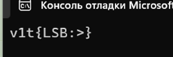

Проверим полученный нами флаг.

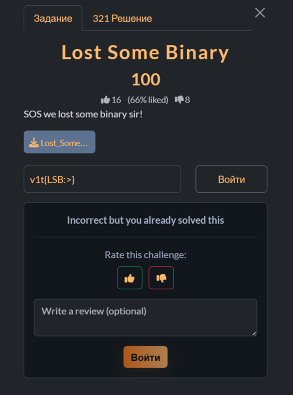

---

***Modulo Mystery***
---

Задача на Crypto:

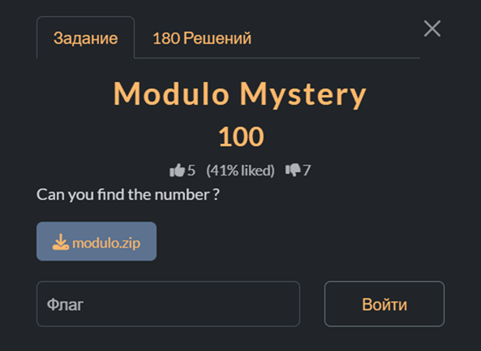

К задаче приложены два файла `modulo.py` и `flag.enc`.

modulo.py

```python
import random

inp = input("Enter plaintext: ")

def encrypt(pt):
    key = random.randint(1, 100)
    results = [str(ord(ch) % key) for ch in pt]   
    print("Encrypted:", " ".join(results))
    with open('flag.enc', 'w') as f:
        f.write(" ".join(results))
    return key

k = encrypt(inp)
print("Key (for debug):", k)
```

Откроем файл `flag.enc`.

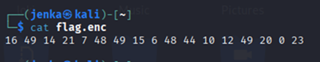

```python
import itertools
import re
import sys

PRINT_MIN = 32
PRINT_MAX = 126
MAX_COMBINATIONS = 2_000_000

PREFIX = "v1t{"
PREFIX_RE = re.compile(r'^v1t\{[^}]{1,200}\}')
FORBIDDEN = set(['?', '=', ',', ':'])

def read_cipher(fn="flag.enc"):
    try:
        with open(fn, "r") as f:
            data = f.read().strip()
            if not data:
                return []
            return [int(x) for x in data.split()]
    except FileNotFoundError:
        print("flag.enc не найден в текущей директории.", file=sys.stderr)
        sys.exit(1)
    except ValueError:
        print("В flag.enc некорректные числа.", file=sys.stderr)
        sys.exit(1)

def options_for_r_allm(r, k):
    opts = []
    if r < 0 or k <= 0:
        return opts
    max_m = (PRINT_MAX - r) // k
    for m in range(max_m + 1):
        val = r + m * k
        if PRINT_MIN <= val <= PRINT_MAX:
            opts.append(chr(val))
    return opts

def try_key_bruteforce_prefix(cipher, k, prefix=PREFIX):
    per_pos = []
    for r in cipher:
        opts = options_for_r_allm(r, k)
        if not opts:
            return [] 
        per_pos.append(opts)

    prefix_len = len(prefix)
    if len(per_pos) < prefix_len:
        return []
    for i in range(prefix_len):
        if prefix[i] not in per_pos[i]:
            return []

    total = 1
    for opts in per_pos:
        total *= len(opts)
        if total > MAX_COMBINATIONS:
            print(f"[key={k}] пропускаю (комбинаций {total} > {MAX_COMBINATIONS})", file=sys.stderr)
            return []

    found = []
    for combo in itertools.product(*per_pos):
        if not combo[:prefix_len] == tuple(prefix):
            continue
        s = ''.join(combo)
        m = PREFIX_RE.match(s)
        if m:
            flag = m.group(0)
            if any(ch in FORBIDDEN for ch in flag):
                continue
            found.append(flag)
    return sorted(set(found))

def main():
    cipher = read_cipher("flag.enc")
    if not cipher:
        return

    for k in range(50, 101):
        flags = try_key_bruteforce_prefix(cipher, k)
        if flags:
            for f in flags:
                print(f"{f}  key={k}")
            return

if __name__ == "__main__":
    main()
```

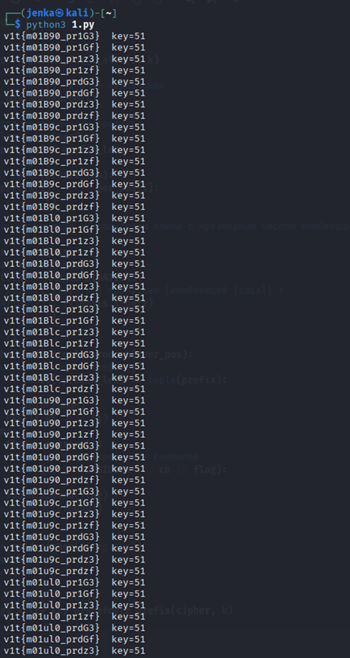

Проверим флаг.

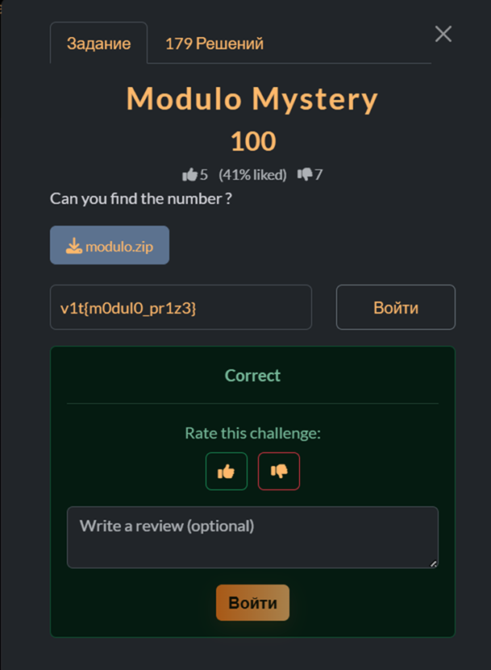

---

***Misconfigured RSA***
---

Задача на Crypto:

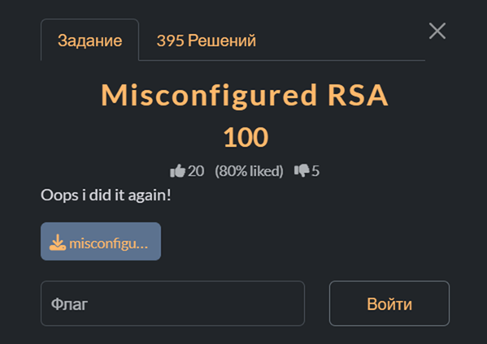

К задаче прикреплен файл со следующим содержимым:

Lost_Some_Binary.txt

```
n = 148900953097814724338206947679223698832179691968218755697733749707084556942286184505525791780949441847197006147827388400754499224336852575956050210608024912280019773833889546324355353746095214275985515374968532505153145975517881297436944244066461866248895871696012367810254055557824874852294865749524482337551
e = 65537
c = 107217087223013352864419426588613439434708031699522027786711684217439431898186052583896596846379575153070982123347045493427454234913154021933229641985591412104222934496019950746514726800406326146713516918611779367873873294259462206805554572977819244626333164240237423211396727885901436510649294574529712562954
```

```python
from math import isqrt, gcd
import random
from collections import Counter

n = int("148900953097814724338206947679223698832179691968218755697733749707084556942286184505525791780949441847197006147827388400754499224336852575956050210608024912280019773833889546324355353746095214275985515374968532505153145975517881297436944244066461866248895871696012367810254055557824874852294865749524482337551")
e = 65537
c = int("107217087223013352864419426588613439434708031699522027786711684217439431898186052583896596846379575153070982123347045493427454234913154021933229641985591412104222934496019950746514726800406326146713516918611779367873873294259462206805554572977819244626333164240237423211396727885901436510649294574529712562954")

def invmod(a, m):
    t, new_t = 0, 1
    r, new_r = m, a % m
    while new_r:
        q = r // new_r
        t, new_t = new_t, t - q * new_t
        r, new_r = new_r, r - q * new_r
    if r != 1:
        raise ValueError("inverse does not exist")
    return t % m

def is_probable_prime(n, k=12):
    if n < 2:
        return False
    small = [2,3,5,7,11,13,17,19,23,29,31,37]
    for p in small:
        if n % p == 0:
            return n == p
    d, r = n - 1, 0
    while d % 2 == 0:
        d //= 2; r += 1
    for _ in range(k):
        a = random.randrange(2, n - 1)
        x = pow(a, d, n)
        if x in (1, n-1):
            continue
        for __ in range(r-1):
            x = pow(x, 2, n)
            if x == n-1:
                break
        else:
            return False
    return True

def pollard_rho(n):
    if n % 2 == 0:
        return 2
    while True:
        x = random.randrange(2, n - 1)
        y, c, d = x, random.randrange(1, n - 1), 1
        while d == 1:
            x = (x*x + c) % n
            y = (y*y + c) % n
            y = (y*y + c) % n
            d = gcd(abs(x - y), n)
        if d != n:
            return d

def trial_division(n, bound=100000):
    primes = [2,3,5]
    for p in primes:
        while n % p == 0:
            yield p
            n //= p
    f = 7
    step = [4,2,4,2,4,6,2,6]
    i = 0
    while f*f <= n and f <= bound:
        while n % f == 0:
            yield f
            n //= f
        f += step[i]; i = (i+1) % 8
    if n > 1:
        yield from _factor_rest(n)

def _factor_rest(n):
    if n == 1:
        return
    if is_probable_prime(n):
        yield n
        return
    d = pollard_rho(n)
    yield from _factor_rest(d)
    yield from _factor_rest(n // d)

def factor_full(n):
    return list(trial_division(n))

def phi_from_factors(factors):
    cnt = Counter(factors)
    phi = 1
    for p, a in cnt.items():
        phi *= (p - 1) * pow(p, a - 1)
    return phi, cnt

def int_to_bytes(m):
    return m.to_bytes((m.bit_length() + 7) // 8, 'big')

def try_decode(b):
    try:
        return b.decode()
    except UnicodeDecodeError:
        return b

def main():
    factors = factor_full(n)
    prod = 1
    for f in factors: prod *= f
    if prod != n:
        rest = n // prod
        factors += factor_full(rest)

    phi, cnt = phi_from_factors(factors)


    d = invmod(e, phi)

    m = pow(c, d, n)
    mb = int_to_bytes(m)
    print("Flag:")
    print(try_decode(mb))

if __name__ == "__main__":
    main()
```

Запустим программу и получим флаг.

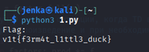

Проверим полученный нами флаг.

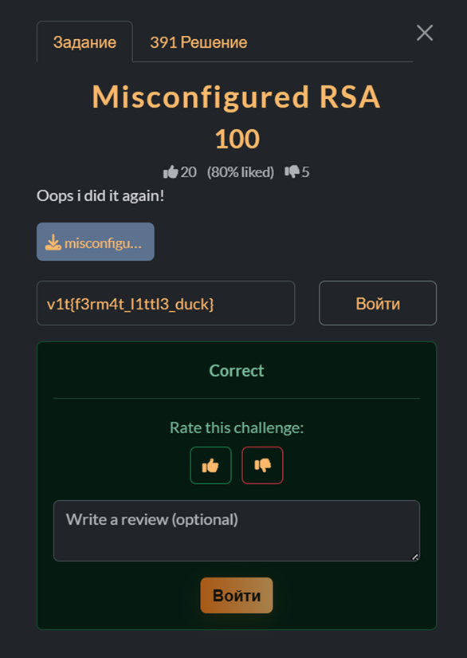

---

***RandomStuff***
---

Задача на Crypto:

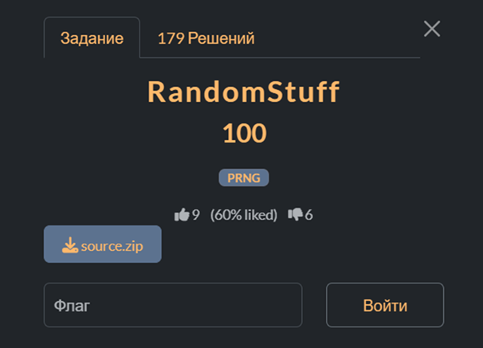

К задаче приложены два файла `part1.py` и `part2.py`.

part1.py

```python
from Crypto.Util.number import *
from hashlib import *
from Crypto.Cipher import AES
from Crypto.Util.Padding import *
part_1 = "s0me_r4nd0m_str1ng".encode()

class LCG():
    
    def __init__(self, seed, a, c, m):
        self.seed = seed
        self.a = a
        self.c = c
        self.m = m
        self.state = seed
        
    def next(self):
        
        self.seed = (self.a * self.seed ** 65537 + self.c) % m
        return self.seed >> 20
    
a = getPrime(50)
c = getPrime(50)
m = getPrime(100)
seed = getRandomInteger(50)

lcg = LCG(seed, a, c, m)

key = sha256(long_to_bytes(seed)).digest()
enc = AES.new(key, AES.MODE_ECB).encrypt(pad(part_1, 16))


print(f"{enc = }")
print(f"{a = }")
print(f"{c = }")
print(f"{m = }")
print(f"{lcg.next() = }")
'''
enc = b'\xe6\x97\x9f\xb9\xc9>\xde\x1e\x85\xbb\xebQ"Ii\xda\'\x1f\xae\x19\x05M\x01\xe1kzS\x8fi\xf4\x8cz'
a = 958181900694223
c = 1044984108221161
m = 675709840048419795804542182249
lcg.next() = 176787694147066159797379
'''
```

part2.py

```python
def main():
    flag = bytearray(b"th4t_y0u_h4ve_t0_f1nd")
    length = len(flag)

    for i in range(length):
        if i > 0:
            flag[i] ^= flag[i-1]

        v = flag[i] & 0xFF
        v ^= (v >> 4)
        v &= 0xFF
        v ^= (v >> 3)
        v &= 0xFF
        v ^= (v >> 2)
        v &= 0xFF
        v ^= (v >> 1)
        v &= 0xFF

        flag[i] = v
        print(f"{v:02x}", end="")

if __name__ == "__main__":
    main()

'''
6768107b1a357132741539783d6a661b5f3b
'''
```

Напишем программу для решения 1 части задания.

```python
from hashlib import sha256
from Crypto.Cipher import AES
from Crypto.Util.Padding import unpad
from Crypto.Util.number import long_to_bytes
import sys

enc = b'\xe6\x97\x9f\xb9\xc9>\xde\x1e\x85\xbb\xebQ"Ii\xda\'\x1f\xae\x19\x05M\x01\xe1kzS\x8fi\xf4\x8cz'
a = 958181900694223
c = 1044984108221161
m = 675709840048419795804542182249
lcg_next_shifted = 176787694147066159797379

SEED_BITS = 50
MAX_SEED = 1 << SEED_BITS

try:
    inv_a = pow(a, -1, m)
except ValueError:
    print("Не удалось найти обратный к a modulo m. Проверь a и m.", file=sys.stderr)
    sys.exit(1)

from math import gcd
if gcd(65537, m-1) != 1:
    print("gcd(65537, m-1) != 1 — обратного показателя не существует, метод не применим.", file=sys.stderr)
    sys.exit(1)

inv_e = pow(65537, -1, m-1)

start = lcg_next_shifted << 20
end = (lcg_next_shifted + 1) << 20
total = end - start
print(f"Ищем seed в диапазоне seed_after=[{start}, {end}) => {total} вариантов...")

checked = 0
for seed_after in range(start, end):
    checked += 1
    r = ((seed_after - c) * inv_a) % m
    seed_candidate = pow(r, inv_e, m)
    if seed_candidate >= MAX_SEED:
        continue

    key = sha256(long_to_bytes(seed_candidate)).digest()
    aes = AES.new(key, AES.MODE_ECB)
    try:
        pt = unpad(aes.decrypt(enc), 16)
    except Exception:
        continue

    if b"s0me_r4nd0m_str1ng" in pt or all(32 <= b <= 126 for b in pt):
        print("=== FOUND ===")
        print("seed =", seed_candidate)
        print("seed_after =", seed_after)
        print("key (sha256):", key.hex())
        print("plaintext:", pt)
        sys.exit(0)

    if checked % 100000 == 0:
        print(f"checked {checked}/{total} ...")

print("Не найдено в этом диапазоне.")
```
Для второй части.

```python
import binascii

hex_in = "6768107b1a357132741539783d6a661b5f3b"
data = bytes.fromhex(hex_in)

def F(x):
    v = x & 0xFF
    v ^= (v >> 4); v &= 0xFF
    v ^= (v >> 3); v &= 0xFF
    v ^= (v >> 2); v &= 0xFF
    v ^= (v >> 1); v &= 0xFF
    return v

invF = {}
for x in range(256):
    y = F(x)
    invF[y] = x

n = len(data)
orig = [0]*n
for i in range(n):
    y = data[i]
    if y not in invF:
        raise ValueError(f"Не удалось обратить байт {y:02x}")
    b = invF[y]
    if i == 0:
        orig[i] = b
    else:
        orig[i] = b ^ data[i-1]

flag = bytes(orig)
print("Recovered flag bytes (raw):", flag)
try:
    print("As ASCII:", flag.decode())
except:
    print("Не-ASCII вывод:", flag)
```

Запустим обе программы и получим 2 части флага.

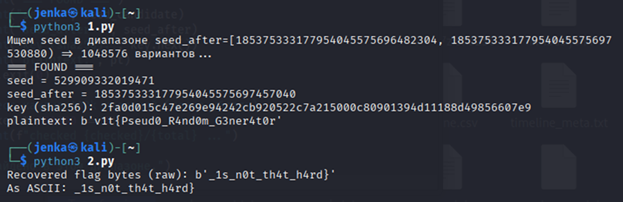

Сложим полученные две части и проверим флаг.

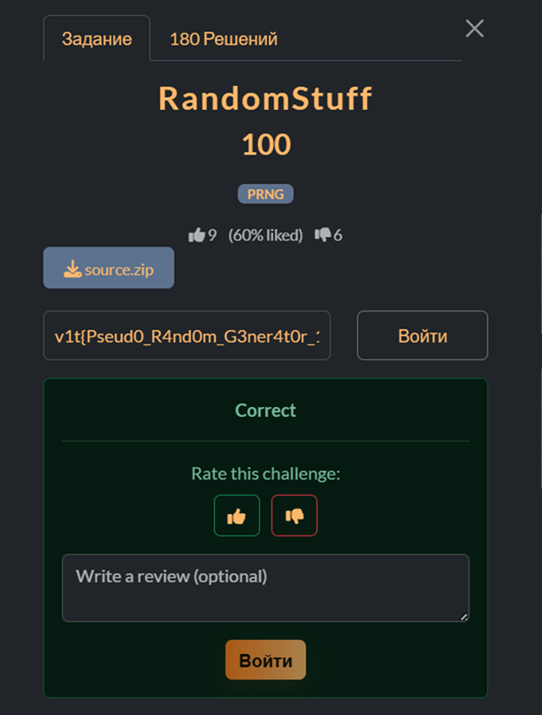

---

***Emoji Thief***
---

Задача на Misc:


```python
import re

S = "💀󠅉"

BASE = 0xE0100
MIN_CP, MAX_CP = BASE, 0xE01FF

def decode_tags(s: str) -> str:
    out = []
    for ch in s:
        cp = ord(ch)
        if MIN_CP <= cp <= MAX_CP:
            b = (cp - BASE) ^ 0x10
            if 32 <= b <= 126:
                out.append(chr(b))
    txt = " ".join("".join(out).split())
    txt = txt.replace("!)", "AI")
    return txt

def extract_flag(text: str) -> str | None:
    m = re.search(r"[A-Za-z0-9_]+{[^}]+}", text)
    return m.group(0) if m else None

def main():
    decoded = decode_tags(S)
    flag = extract_flag(decoded)
    print(flag if flag else decoded)

if __name__ == "__main__":
    main()
```

Запустим программу и получим флаг.

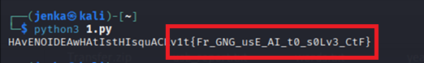

Проверим флаг.


