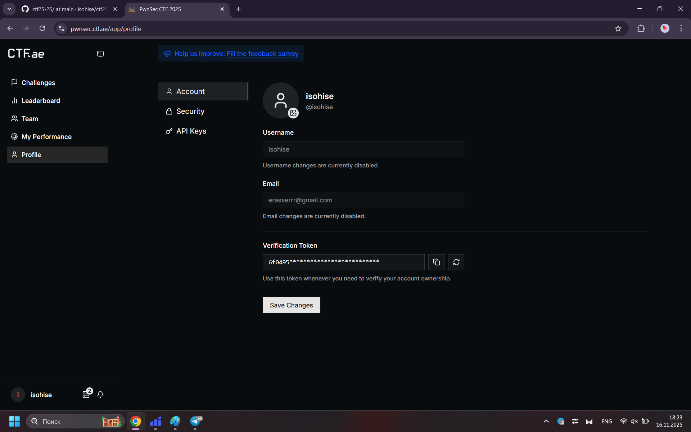
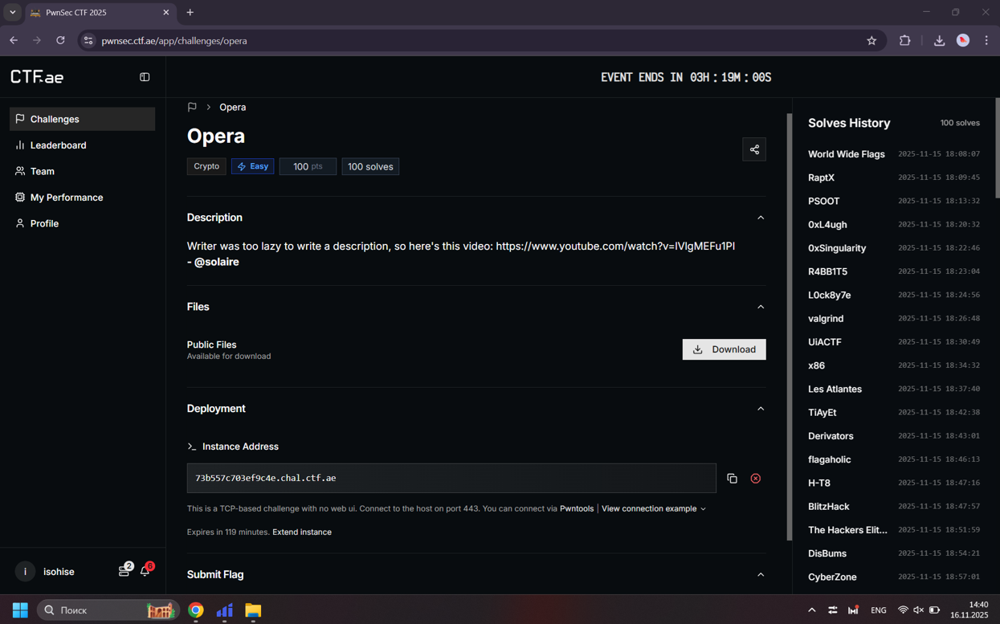
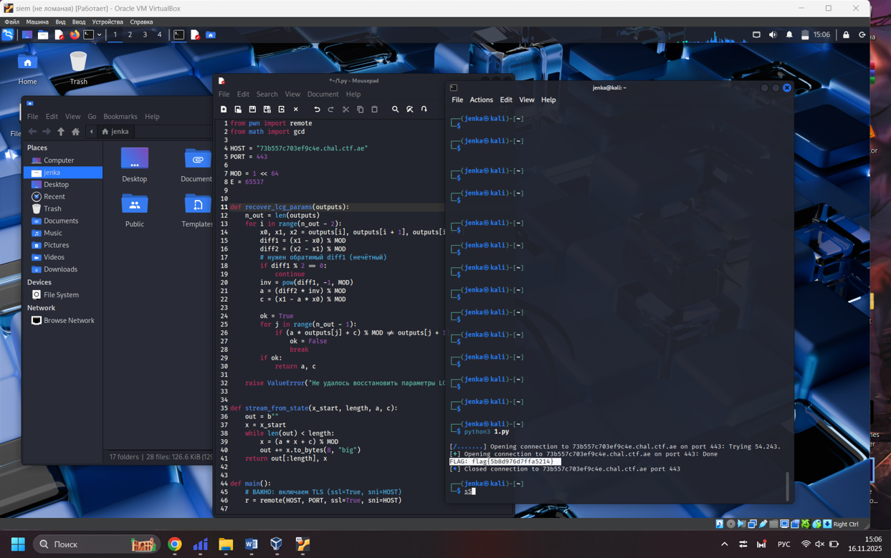
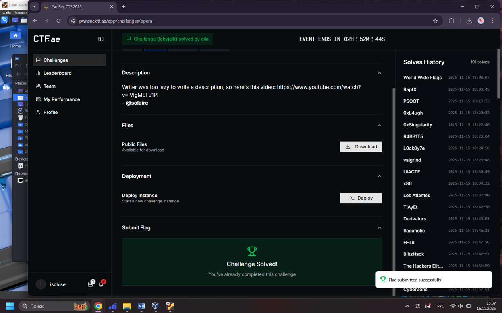
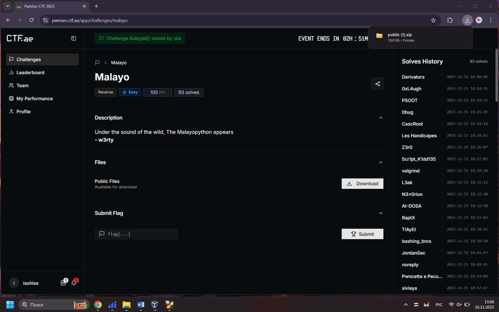
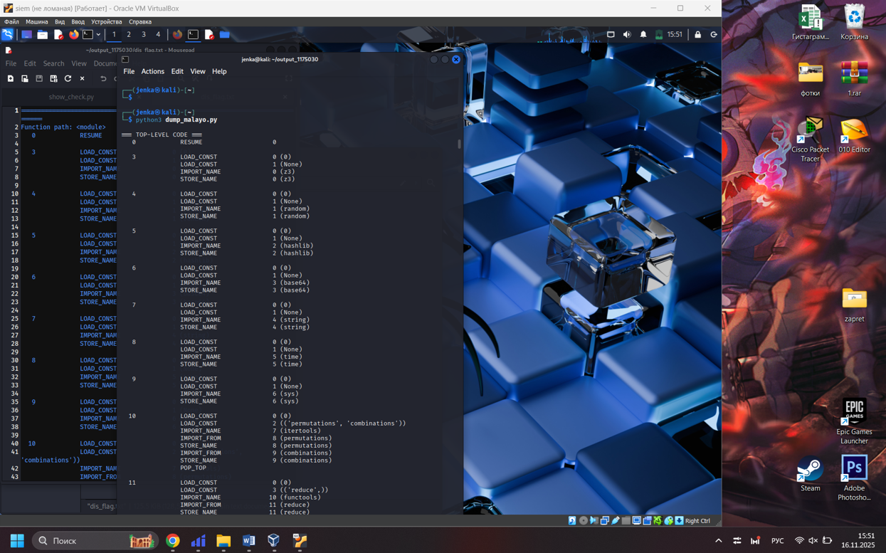
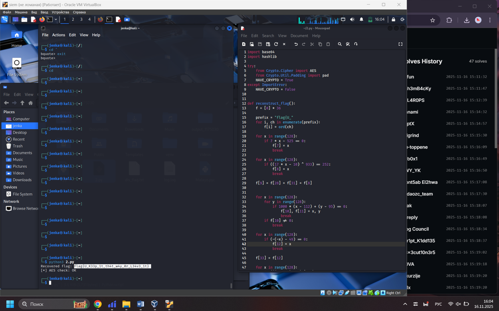
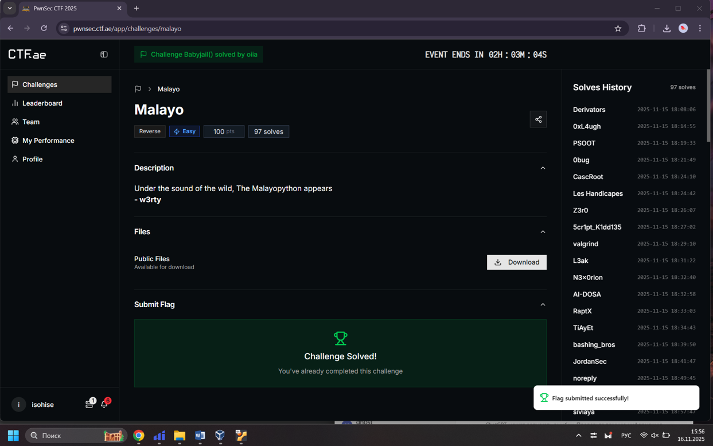

[PwnSec CTF 2025](https://pwnsec.ctf.ae/)



---

***Opera***
---



Для решения данной задачи напишем программу, которая подключается к серверу, собирает несколько зашифрованных ответов и по ним восстанавливает параметры линейного конгруэнтного генератора, чтобы восстановить поток байтов, использованный для маскирования флага. Затем она снимает эту маску, проводит атаку на RSA (разлагает модуль на множители) и с помощью найденного закрытого ключа расшифровывает флаг.

```python
from pwn import remote
from math import gcd

HOST = "73b557c703ef9c4e.chal.ctf.ae"
PORT = 443

MOD = 1 << 64
E = 65537


def recover_lcg_params(outputs):
    n_out = len(outputs)
    for i in range(n_out - 2):
        x0, x1, x2 = outputs[i], outputs[i + 1], outputs[i + 2]
        diff1 = (x1 - x0) % MOD
        diff2 = (x2 - x1) % MOD
        if diff1 % 2 == 0:
            continue
        inv = pow(diff1, -1, MOD)
        a = (diff2 * inv) % MOD
        c = (x1 - a * x0) % MOD

        ok = True
        for j in range(n_out - 1):
            if (a * outputs[j] + c) % MOD != outputs[j + 1]:
                ok = False
                break
        if ok:
            return a, c

    raise ValueError("Не удалось восстановить параметры LCG")


def stream_from_state(x_start, length, a, c):
    out = b""
    x = x_start
    while len(out) < length:
        x = (a * x + c) % MOD
        out += x.to_bytes(8, "big")
    return out[:length], x


def main():
    r = remote(HOST, PORT, ssl=True, sni=HOST)
    r.recvuntil(b"> ")

    r.sendline(b"1")
    enc_flag_hex = r.recvline().strip()
    n_line = r.recvline().strip()

    enc_flag = bytes.fromhex(enc_flag_hex.decode())
    n = int(n_line.decode())


    Q = 5
    K_segments = []
    for _ in range(Q):
        r.recvuntil(b"> ")
        r.sendline(b"2")
        r.recvuntil(b"> ")
        r.sendline(b"")
        resp_hex = r.recvline().strip()
        K_segments.append(bytes.fromhex(resp_hex.decode()))

    stream_bytes = b"".join(K_segments)
    assert len(stream_bytes) % 8 == 0
    outputs = [
        int.from_bytes(stream_bytes[i : i + 8], "big")
        for i in range(0, len(stream_bytes), 8)
    ]

    a, c = recover_lcg_params(outputs)
    a_inv = pow(a, -1, MOD)

    s = outputs[-1]
    for _ in range(4 * Q):
        s = ((s - c) * a_inv) % MOD
    xs_back = []
    cur = s
    for _ in range(8):
        xs_back.append(cur)
        cur = ((cur - c) * a_inv) % MOD
    xs_flag = list(reversed(xs_back))  # x1..x8

    K_flag = b"".join(x.to_bytes(8, "big") for x in xs_flag)
    K_flag = K_flag[: len(enc_flag)]

    Cflag = bytes(cf ^ kf for cf, kf in zip(enc_flag, K_flag))

    r.recvuntil(b"> ")
    r.sendline(b"2")
    r.recvuntil(b"> ")

    s_query = b"A"
    r.sendline(s_query)
    resp_hex = r.recvline().strip()
    resp_bytes = bytes.fromhex(resp_hex.decode())

    len_Cp = len(K_segments[0])

    state_remote = outputs[-1]
    K_query, state_remote = stream_from_state(state_remote, len_Cp, a, c)

    C_p_bytes = bytes(rb ^ kb for rb, kb in zip(resp_bytes, K_query))
    c_p_int = int.from_bytes(C_p_bytes, "big")

    m_int = int.from_bytes(s_query, "big")
    c_n_int = pow(m_int, E, n)

    g = gcd(c_n_int - c_p_int, n)
    if g == 1 or g == n:
        print("[-] Не удалось факторизовать n, g =", g)
        r.close()
        return

    p = g
    q = n // p
    phi = (p - 1) * (q - 1)
    d = pow(E, -1, phi)

    cflag_int = int.from_bytes(Cflag, "big")
    m_flag_int = pow(cflag_int, d, n)
    m_flag = m_flag_int.to_bytes((m_flag_int.bit_length() + 7) // 8, "big")

    print("FLAG:", m_flag.decode(errors="ignore"))

    r.close()


if __name__ == "__main__":
    main()
```

Выполним написанную программу и получим флаг.



Проверим полученный нами флаг.



---

***Malayo***
---



Откроем файл, приложенный к задаче, в декомпиляторе, посмотрим на получившийся байткод с множеством проверок и констант и по этим выражениям выпишем ограничения на отдельные символы флага (уравнения, XOR, суммы и проверку через AES). Из этого вывода стало понятно, какие именно формулы нужно перенести в программу, чтобы не решать всё вручную.



Для решения задачи напишем программу, которая по этим ограничениям последовательно вычисляет значения элементов массива `f`, собирает из них строку флага и проверяет, что она подходит по сумме символов. Затем скрипт проводит такую же AES-проверку, как в исходном коде, и тем самым удостоверяется, что восстановлен корректный флаг.

```python
import base64
import hashlib

try:
    from Crypto.Cipher import AES
    from Crypto.Util.Padding import pad
    HAVE_CRYPTO = True
except ImportError:
    HAVE_CRYPTO = False


def reconstruct_flag():
    f = [0] * 36

    prefix = "flag{U_"
    for i, ch in enumerate(prefix):
        f[i] = ord(ch)

    for x in range(128):
        if 7 * x - 525 == 0:
            f[7] = x
            break

    for x in range(128):
        if ((17 * x - 10) ^ 933) == 252:
            f[8] = x
            break

    f[9] = f[28] = f[31] = f[8]


    for x in range(128):
        for y in range(128):
            if 1000 * (x - 112) + (y - 95) == 0:
                f[10], f[11] = x, y
                break
        if f[10] != 0:
            break

    for x in range(128):
        if (~(~x) - 49) == 0:
            f[12] = x
            break
            
    f[33] = f[12]

    for x in range(128):
        if (((x + 10) * 5) ^ 95) == 553:
            f[13] = x
            break

    f[15] = f[18] = f[34] = f[13]

    for idx in (14, 19, 23, 26, 32):
        f[idx] = f[11]


    for x in range(128):
        if 2 * x - 12 - 196 == 0:
            f[16] = x
            break


    for x in range(128):
        if ((x << 0) ^ 0) == 52:
            f[17] = x
            break


    f[21] = f[29] = f[17]


    for x in range(128):
        if 3 * x - 357 == 0:
            f[20] = x
            break


    f[22] = f[20] + 2


    for x in range(128):
        if (x ^ 0) - 48 == 0:
            f[24] = x
            break


    f[25] = f[22] - 7


    f[35] = 125


    base_sum = sum(f[i] for i in range(36) if i not in (27, 30))
    candidates = []
    for a in range(32, 127):      # печатные ASCII
        for b in range(32, 127):
            if (a - 76) * (b - 118) != 0:
                continue
            if base_sum + a + b == 3217:
                candidates.append((a, b))

    if not candidates:
        raise RuntimeError("Не нашли пару (f[27], f[30]) по ограничениям")


    f[27], f[30] = candidates[0]

    flag = "".join(chr(x) for x in f)


    assert len(flag) == 36
    assert sum(ord(c) for c in flag) == 3217

    return flag


def verify_aes(flag: str):
    if not HAVE_CRYPTO:
        print("[!] Модуль Crypto не найден, AES-проверку пропускаем")
        return

    f = [ord(c) for c in flag]


    flag_content = "".join(chr(x) for x in f[7:35])
    key_part = flag_content[:17]
    plaintext = flag_content[17:]

    key = hashlib.sha256(key_part.encode()).digest()
    iv = b"PWNSEC_CHALLENGE"
    cipher = AES.new(key, AES.MODE_CBC, iv)
    padded = pad(plaintext.encode(), AES.block_size)
    ciphertext = cipher.encrypt(padded)

    expected = base64.b64decode("jNtv1ielcDMRvnTLzB2hrg==")

    print("[*] AES check:", "OK" if ciphertext == expected else "FAIL")


def main():
    flag = reconstruct_flag()
    print("Recovered flag:", flag)
    verify_aes(flag)


if __name__ == "__main__":
    main()
```

Запустим программу и получим флаг.



Проверим полученный флаг.


