[HeroCTF](https://ctf.heroctf.fr)

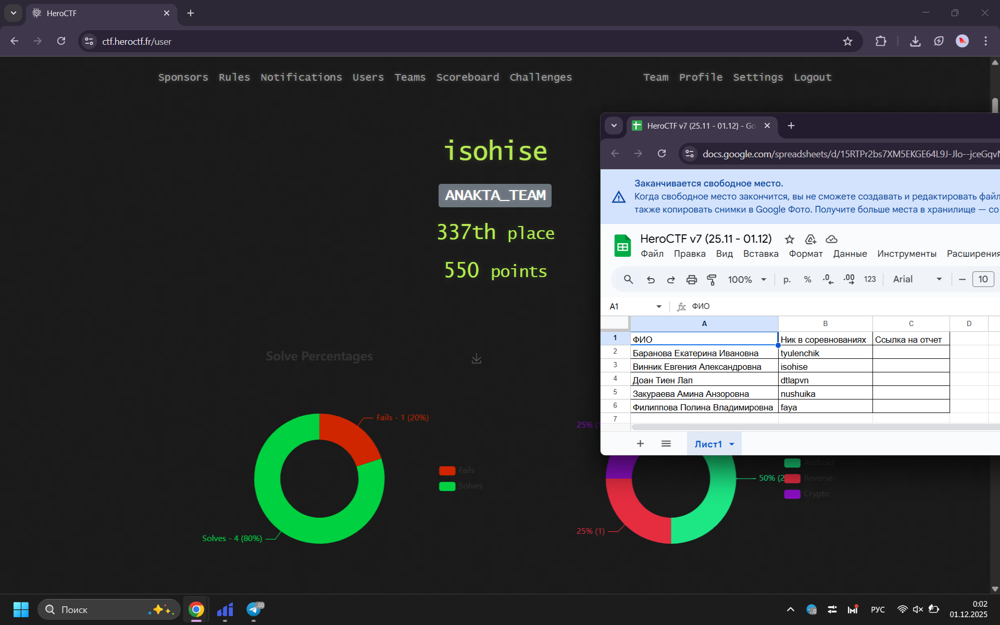

---

***Andor***
---

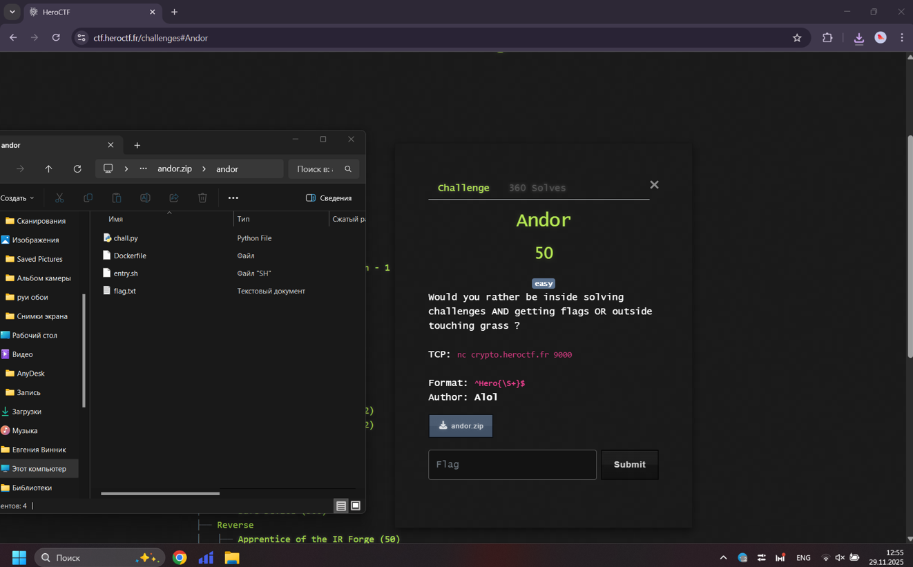

```python
import socket

HOST = "crypto.heroctf.fr"
PORT = 9000

def get_ao(f):
    line = f.readline().decode().strip()
    if not line.startswith("a = "):
        raise RuntimeError("unexpected line: " + line)
    a_hex = line[4:]

    line = f.readline().decode().strip()
    if not line.startswith("o = "):
        raise RuntimeError("unexpected line: " + line)
    o_hex = line[4:]

    f.read(2)

    return bytes.fromhex(a_hex), bytes.fromhex(o_hex)

def main():
    s = socket.create_connection((HOST, PORT))
    f = s.makefile("rwb", buffering=0)

    a, o = get_ao(f)
    l = len(a)

    first = bytearray(l)                
    second = bytearray([0xFF] * len(o))

    for i in range(l):
        first[i] |= a[i]
    for i in range(len(o)):
        second[i] &= o[i]

    for _ in range(100):
        f.write(b"0\n")
        a, o = get_ao(f)

        for i in range(l):
            first[i] |= a[i]

        for i in range(len(o)):
            second[i] &= o[i]

    flag = bytes(first + second)

    try:
        print(flag.decode())
    except UnicodeDecodeError:
        print(flag)

    s.close()

if __name__ == "__main__":
    main()
```

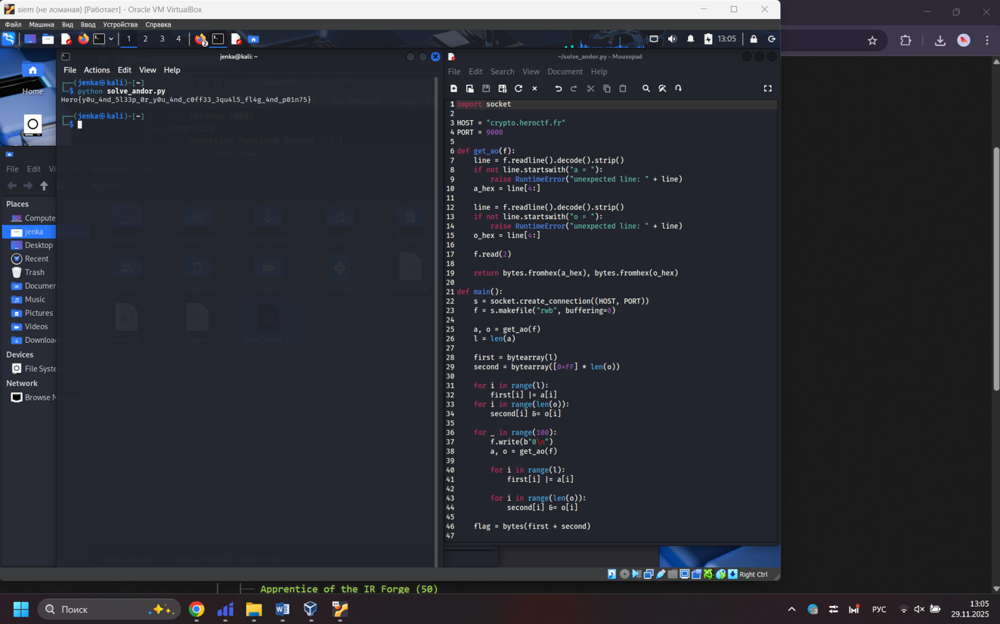

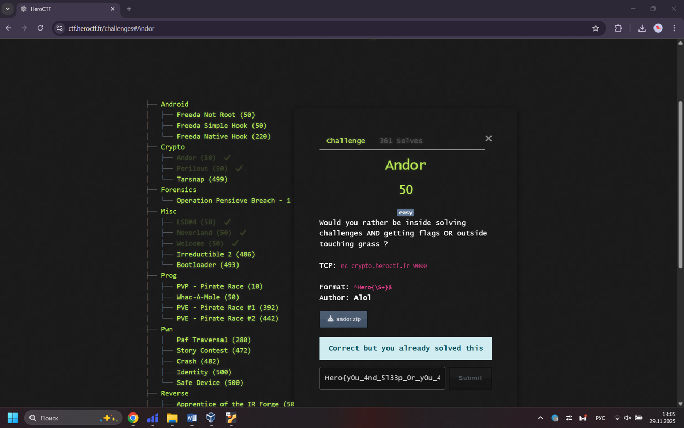

---

***Apprentice of the IR Forge***
---

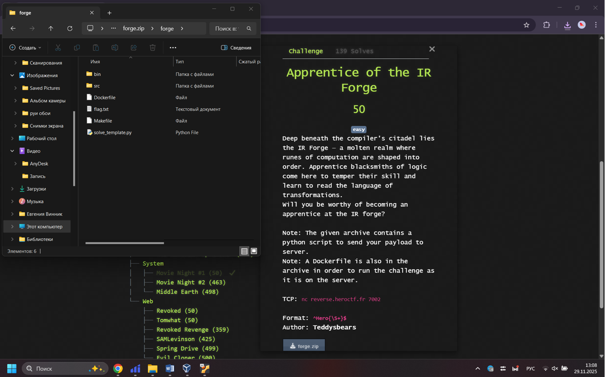

src/valid_pass.c
```c
#include <stdint.h>

static int storage;

int *SWORD_OF_THE_HERO(int a, int b, int c) {
    storage = a + b + c;
    return &storage;
}

int main(void) {
    (void)SWORD_OF_THE_HERO(1, 2, 3);
    return 0;
}
```

solve_template.py
```python
from pwn import *

HOST = "reverse.heroctf.fr"
PORT = 7002

VALID_PASS_FILE = "src/valid_pass.c"

def main():
    conn = remote(HOST, PORT)

    with open(VALID_PASS_FILE, "rb") as f:
        code = f.read()

    conn.send(code)
    conn.shutdown('send')

    print(conn.recvall().decode("utf-8"))
    conn.close()

if __name__ == "__main__":
    main()
```

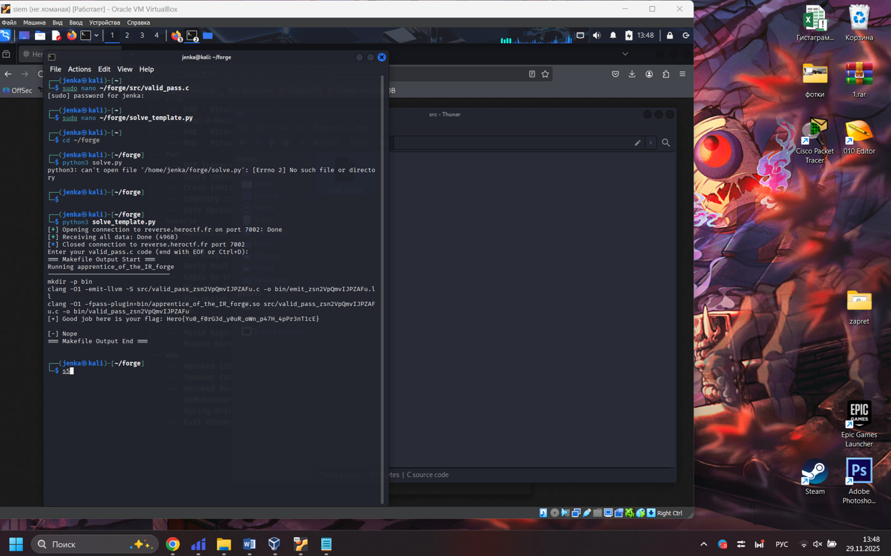

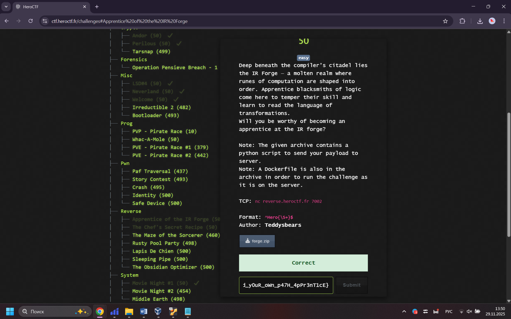

---

***Freeda Simple Hook***
---

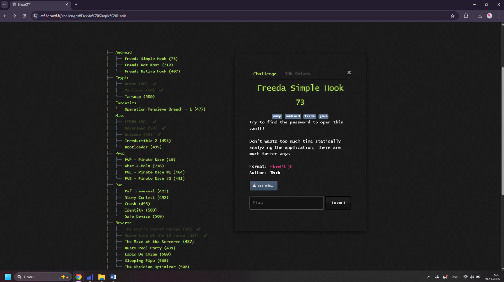

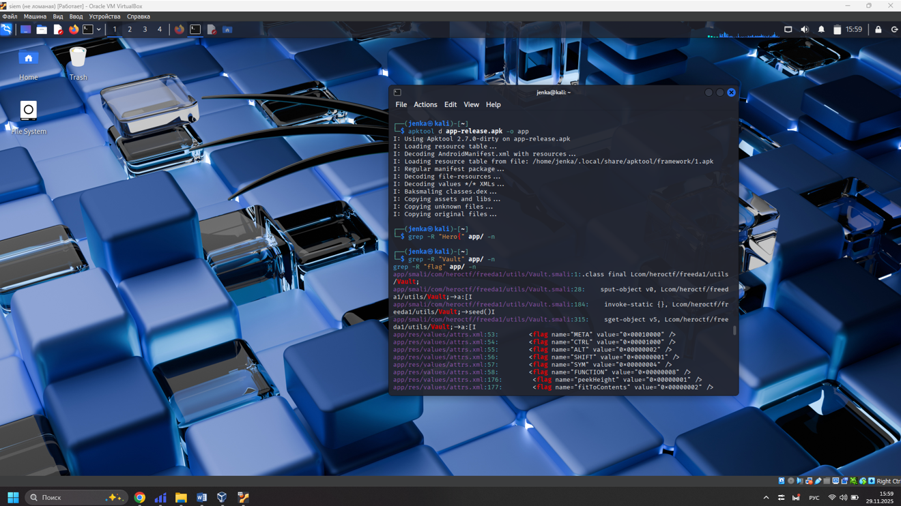

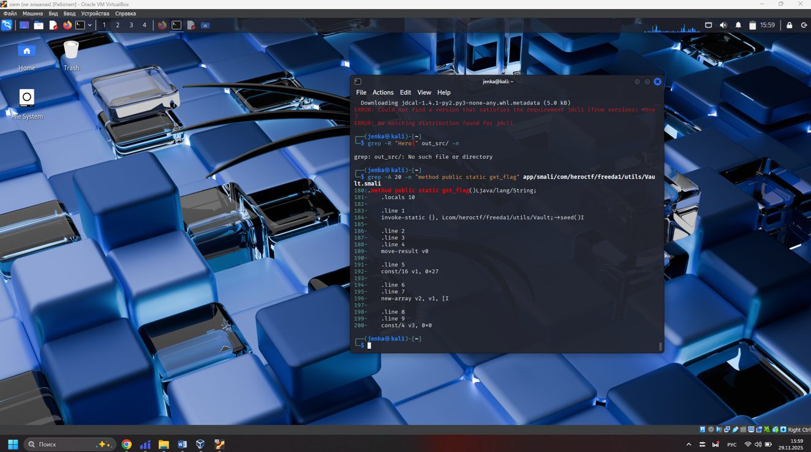

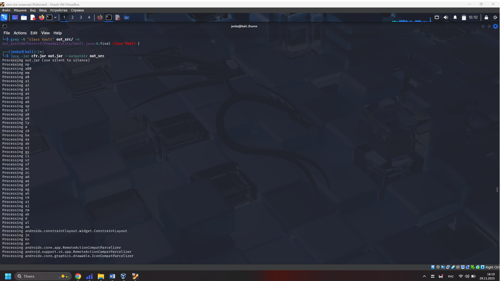

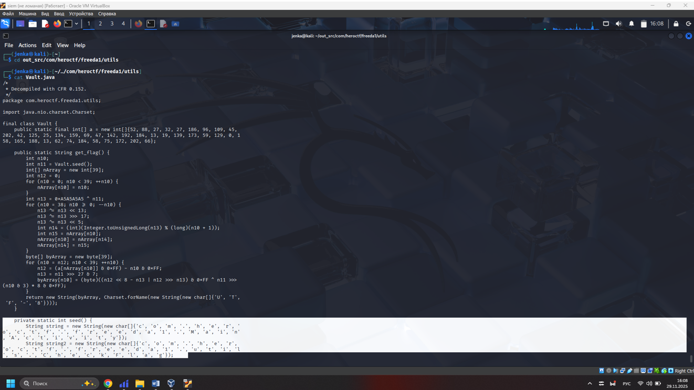

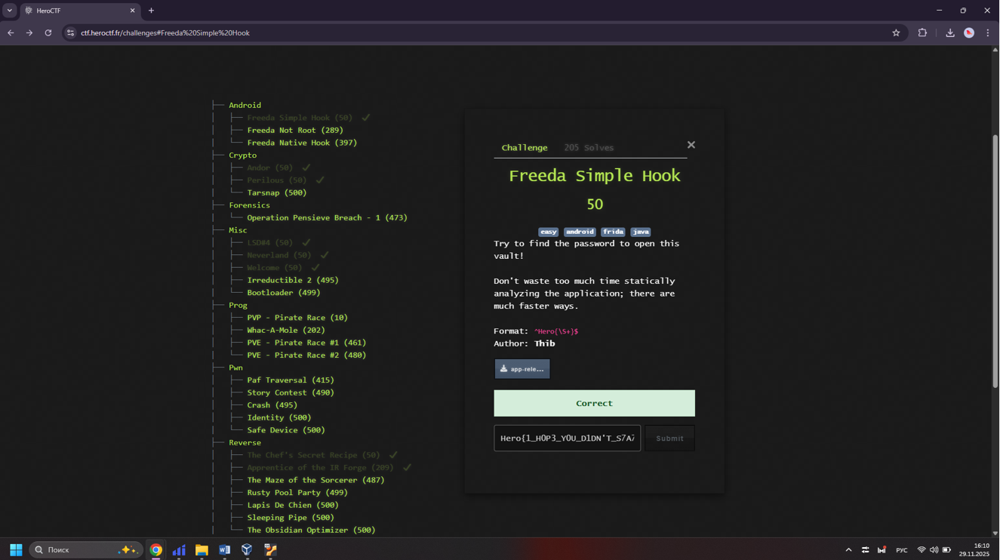

---

***Freeda Not Root***
---

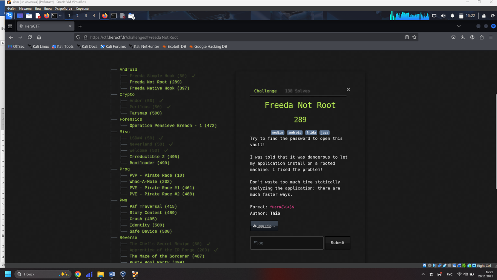

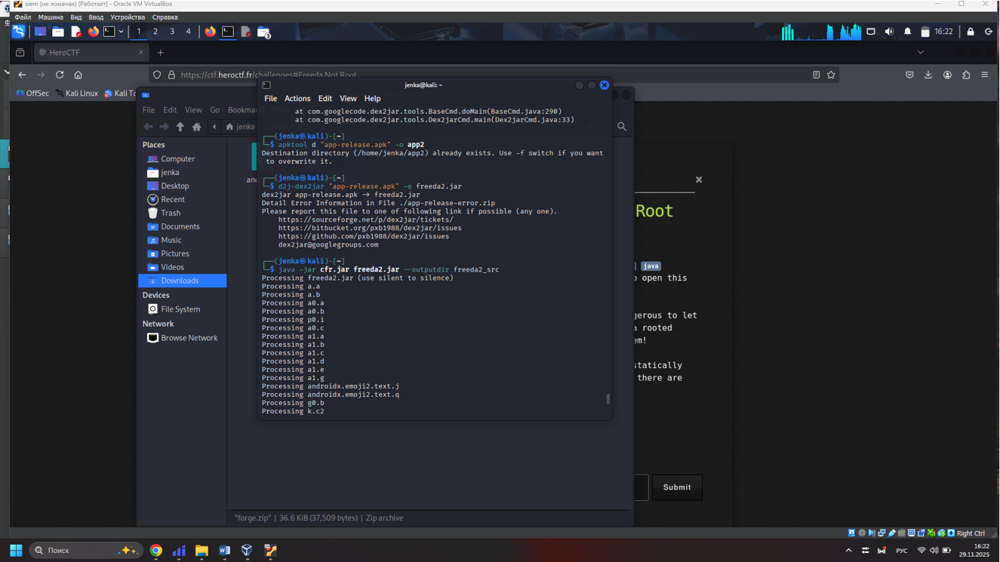

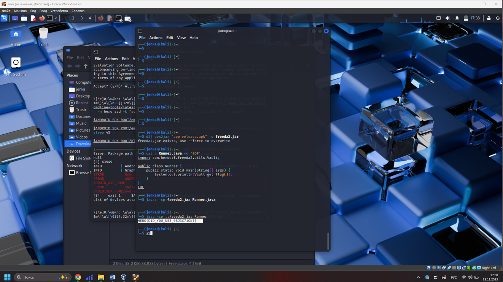

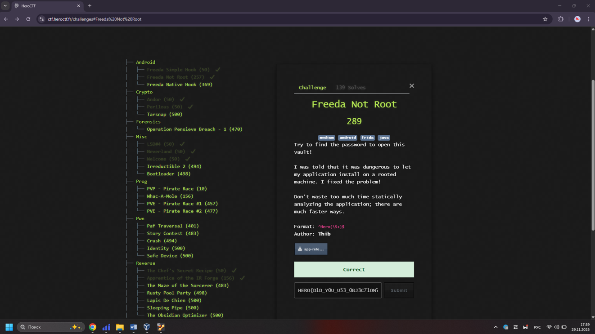
