[KyCor](https://ctf.cykor.kr)


---

***wram-up***
---

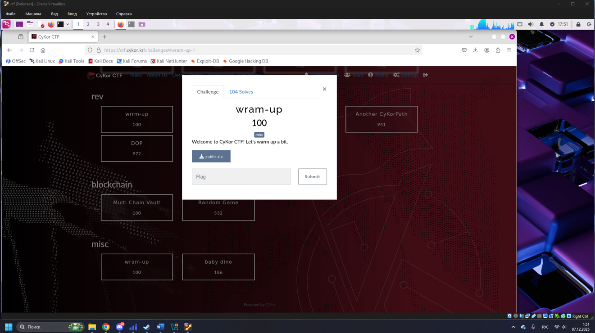

Напишем скрипт, в котором подключим модуль лабиринта и файл `wasm`, инициализируем объект `Maze` и получим список координат стен. Далее на основе этих данных построим поиск кратчайшего пути по сетке 10×10 от стартовой точки к цели (9,9), восстановим последовательность ходов.

```python
import fs from 'fs';
import { initSync, Maze } from './wr.js';

const bytes = fs.readFileSync('./wr_bg.wasm');
initSync(bytes);

const maze = new Maze();
const wallsArr = maze.get_walls();
console.log("Количество стен:", wallsArr.length);
console.log("Пример координат стен:", wallsArr.slice(0, 10));

const W = 10, H = 10;
const start = [0, 0];
const goal = [9, 9];
const walls = new Set(wallsArr.map(w => `${w.x},${w.y}`));
const key = (x, y) => `${x},${y}`;
const dirs = [
  { dx: 0, dy: -1, ch: 'U' },
  { dx: 0, dy:  1, ch: 'D' },
  { dx: -1, dy: 0, ch: 'L' },
  { dx:  1, dy: 0, ch: 'R' },
];

const q = [start];
const prev = new Map([[key(...start), null]]);
const prevMove = new Map();

while (q.length) {
  const [x, y] = q.shift();
  if (x === goal[0] && y === goal[1]) break;

  for (const { dx, dy, ch } of dirs) {
    const nx = x + dx, ny = y + dy;
    if (nx < 0 || nx >= W || ny < 0 || ny >= H) continue;
    if (walls.has(key(nx, ny))) continue;
    const k = key(nx, ny);
    if (prev.has(k)) continue;
    prev.set(k, [x, y]);
    prevMove.set(k, ch);
    q.push([nx, ny]);
  }
}

let cur = goal;
const path = [];
while (!(cur[0] === start[0] && cur[1] === start[1])) {
  const k = key(...cur);
  const ch = prevMove.get(k);
  path.push(ch);
  cur = prev.get(k);
}
path.reverse();
const pathStr = path.join('');
console.log("\n=== НАЙДЕННЫЙ ПУТЬ ===");
console.log(pathStr);
console.log("Длина:", pathStr.length);

for (const c of pathStr) {
  if (c === 'U') maze.move_up();
  if (c === 'D') maze.move_down();
  if (c === 'L') maze.move_left();
  if (c === 'R') maze.move_right();
}
console.log("\nФлаг:", maze.check());
```

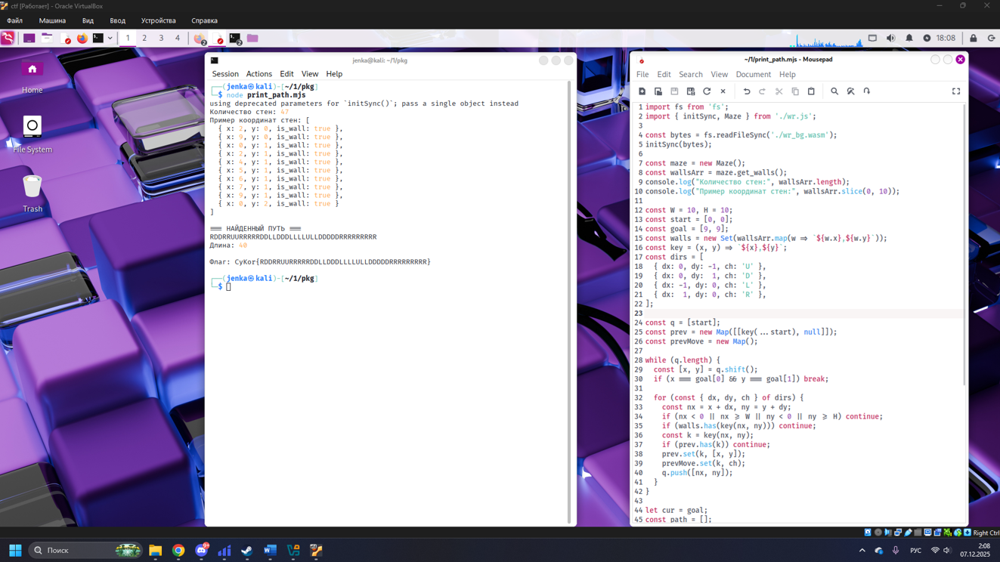

Проверим полученный результат через веб-интерфейс задания, запущенный локально, введём найденный путь по лабиринту и получим флаг.

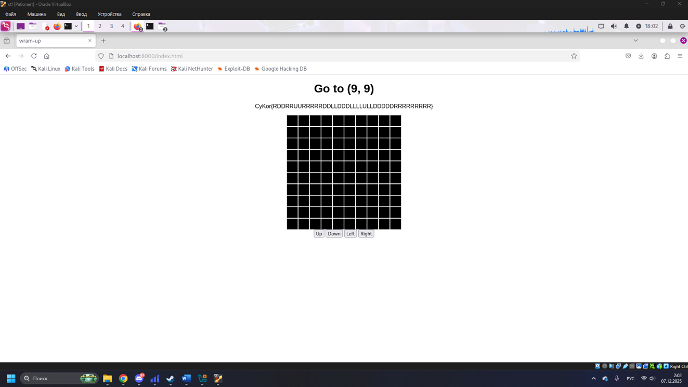

Проверим полученный флаг.

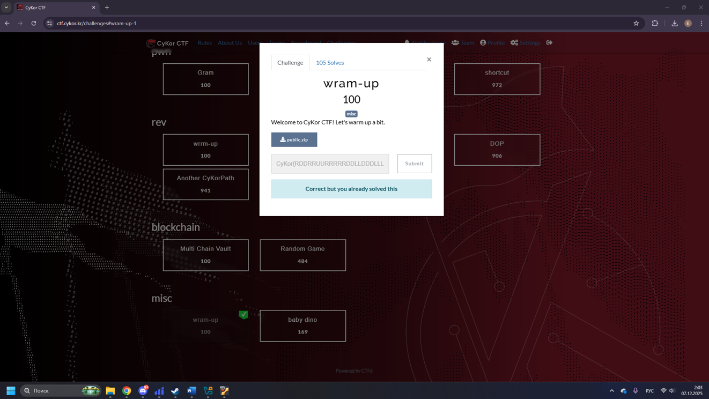

---

***Multi Chain Vault***
---


Подключимся к удалённому сервису через `nc` и пройдем PoW-защиту, получив приватный инстанс блокчейна. После успешной проверки ввода сервис выдал `rpc endpoint`, `private key`, адрес аккаунта и адрес контракта задания.


Подготовим скрипт, в который внесем выданные сервисом значения RPC, приватного ключа и адреса Setup, чтобы получить адреса Vault/Relayer/Token и отправить транзакцию для нарушения инварианта. 

```python
from web3 import Web3
import os

RPC = "http://43.200.126.236:8545/3b2c20a5-57d6-4803-8801-e8079e85f5af"
PK = "0xbedb52856851035d6b20815e38e38f84dee0e695fe9812f6a4dc96c7c989b8f3"
SETUP = "0x030B98A12c198E91E245d712C42F883d4578206a"

w3 = Web3(Web3.HTTPProvider(RPC, request_kwargs={"timeout": 120}))
acct = w3.eth.account.from_key(PK)
print("Address:", acct.address)

abi_setup = [
    {"name": "isSolved", "outputs": [{"type": "bool"}], "stateMutability": "view", "type": "function"},
    {"name": "vault", "outputs": [{"type": "address"}], "stateMutability": "view", "type": "function"},
    {"name": "relayer", "outputs": [{"type": "address"}], "stateMutability": "view", "type": "function"},
    {"name": "token", "outputs": [{"type": "address"}], "stateMutability": "view", "type": "function"},
]

setup = w3.eth.contract(address=SETUP, abi=abi_setup)

VAULT = setup.functions.vault().call()
RELAYER = setup.functions.relayer().call()
TOKEN = setup.functions.token().call()

print("Vault:", VAULT)
print("Relayer:", RELAYER)
print("Token:", TOKEN)

abi_relayer = [{
    "inputs": [
        {"name": "amount", "type": "uint256"},
        {"name": "recipient", "type": "address"},
        {"name": "fee", "type": "uint256"},
        {"name": "feeRecipient", "type": "address"},
        {"name": "feeData", "type": "bytes"}
    ],
    "name": "submitDepositRequest",
    "outputs": [],
    "stateMutability": "payable",
    "type": "function"
}]

relayer = w3.eth.contract(address=RELAYER, abi=abi_relayer)


feeData = bytes(6400) 
amount = 100 * 10**18
fee = 1

tx = relayer.functions.submitDepositRequest(
    amount,
    acct.address,
    fee,
    acct.address,
    feeData
).build_transaction({
    "from": acct.address,
    "value": fee,
    "gas": 5000000,
    "gasPrice": w3.to_wei("1", "gwei"),
    "nonce": w3.eth.get_transaction_count(acct.address)
})

signed = acct.sign_transaction(tx)
tx_hash = w3.eth.send_raw_transaction(signed.rawTransaction)
print("Submitted tx:", tx_hash.hex())
receipt = w3.eth.wait_for_transaction_receipt(tx_hash)
print("Status:", receipt.status)

solved = setup.functions.isSolved().call()
print("isSolved =", solved)
```

Несмотря на корректно введённые данные, подключение к RPC срывалось, из-за чего получить флаг не удалось.


---

***nononono***
---

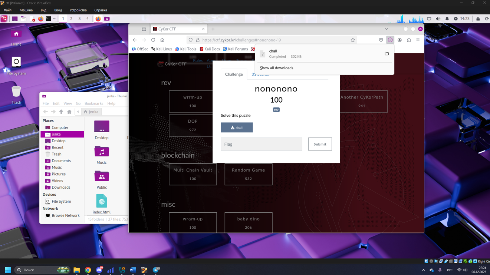

Проведем проверку исполняемого файла и выполним генерацию тестового входного файла с нужным объёмом данных. После неудачного запуска биный файл был пропатчен, что позволило увидеть структуру проверок и вывести строку с флагом, но он не подошел.

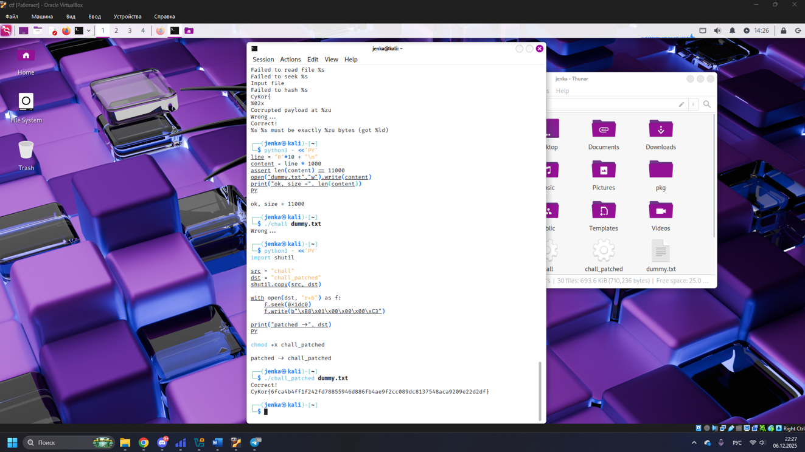

Исследуем в декомпиляторе, стало видно множество проверок и строк с сообщениями об ошибках. Это подтвердило наличие внутренней системы валидации данных, использующей фиксированные размеры, контроль допустимых символов и собственную процедуру хэширования.

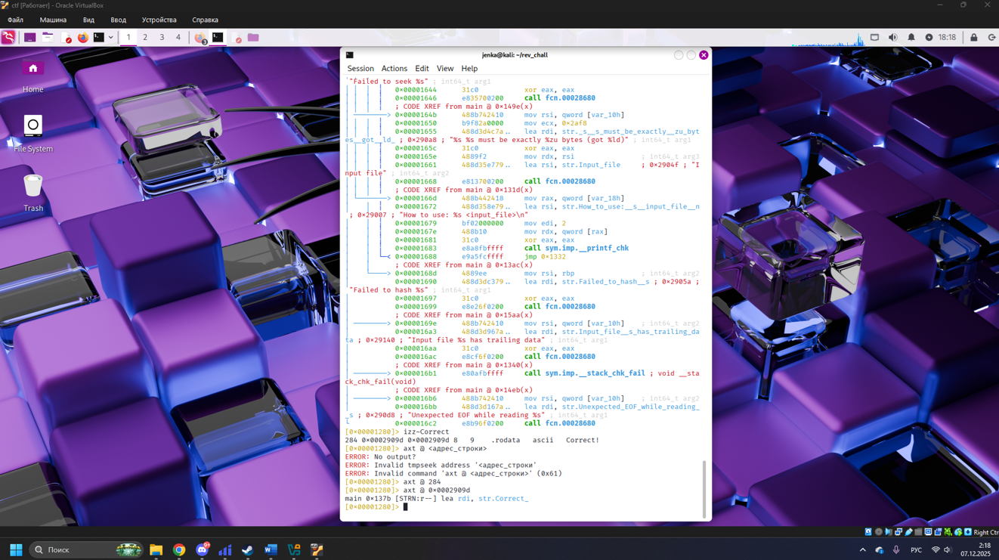

Выполним подробный анализ основной функции программы, в ней видны обращения к системным вызовам чтения файла, проверке его длины и последовательной обработке строковых блоков. Это позволит выделить участок кода, отвечающий за сравнение результата вычислений с эталонным значением и вывод “Correct!”.

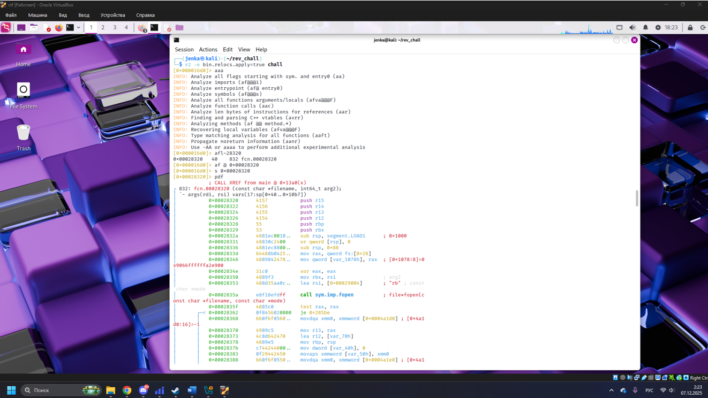

Изучим дизассемблированные участки и подготовим условия для восстановления исходных выражений и вычисления окончательного флага.

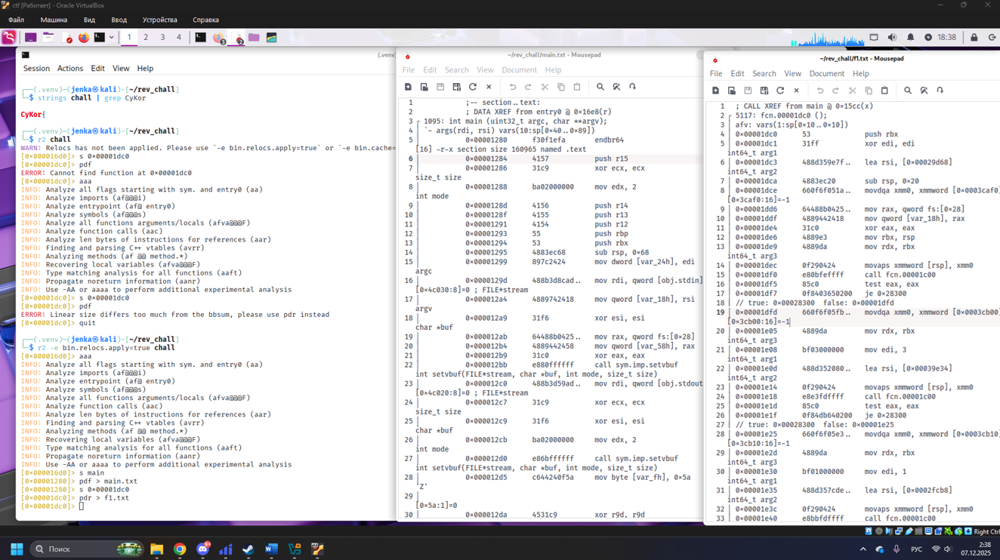

Напишем программу, которая воспроизводит логику вычисления хэша из исходного бинарного файла.

```python
IV512 = bytes.fromhex(
    "000102030405060708090a0b0c0d0e0f"
    "101112131415161718191a1b1c1d1e1f"
    "202122232425262728292a2b2c2d2e2f"
    "303132333435363738393a3b3c3d3e3f"
)
SBOX = [
    0xFC,0xEE,0xDD,0x11,0xCF,0x6E,0x31,0x16,0xFB,0xC4,0xFA,0xDA,0x23,0xC5,0x04,0x4D,
    0xE9,0x77,0xF0,0xDB,0x93,0x2E,0x99,0xBA,0x17,0x36,0xF1,0xBB,0x14,0xCD,0x5F,0xC1,
    0xF9,0x18,0x65,0x5A,0xE2,0x5C,0xEF,0x21,0x81,0x1C,0x3C,0x42,0x8B,0x01,0x8E,0x4F,
    0x05,0x84,0x02,0xAE,0xE3,0x6A,0x8F,0xA0,0x06,0x0B,0xED,0x98,0x7F,0xD4,0xD3,0x1F,
    0xEB,0x34,0x2C,0x51,0xEA,0xC8,0x48,0xAB,0xF2,0x2A,0x68,0xA2,0xFD,0x3A,0xCE,0xCC,
    0xB5,0x70,0x0E,0x56,0x08,0x0C,0x76,0x12,0xBF,0x72,0x13,0x47,0x9C,0xB7,0x5D,0x87,
    0x15,0xA1,0x96,0x29,0x10,0x7B,0x9A,0xC7,0xF3,0x91,0x78,0x6F,0x9D,0x9E,0xB2,0xB1,
    0x32,0x75,0x19,0x3D,0xFF,0x35,0x8A,0x7E,0x6D,0x54,0xC6,0x80,0xC3,0xBD,0x0D,0x57,
    0xDF,0xF5,0x24,0xA9,0x3E,0xA8,0x43,0xC9,0xD7,0x79,0xD6,0xF6,0x7C,0x22,0xB9,0x03,
    0xE0,0x0F,0xEC,0xDE,0x7A,0x94,0xB0,0xBC,0xDC,0xE8,0x28,0x50,0x4E,0x33,0x0A,0x4A,
    0xA7,0x97,0x60,0x73,0x1E,0x00,0x62,0x44,0x1A,0xB8,0x38,0x82,0x64,0x9F,0x26,0x41,
    0xAD,0x45,0x46,0x92,0x27,0x5E,0x55,0x2F,0x8C,0xA3,0xA5,0x7D,0x69,0xD5,0x95,0x3B,
    0x07,0x58,0xB3,0x40,0x86,0xAC,0x1D,0xF7,0x30,0x37,0x6B,0xE4,0x88,0xD9,0xE7,0x89,
    0xE1,0x1B,0x83,0x49,0x4C,0x3F,0xF8,0xFE,0x8D,0x53,0xAA,0x90,0xCA,0xD8,0x85,0x61,
    0x20,0x71,0x67,0xA4,0x2E,0xFD,0x02,0x4B,0x79,0x6C,0x62,0xC2,0xE0,0xF0,0x01,0xF1,
    0x09,0xE6,0x18,0xB6,0x6A,0xD2,0xAF,0x31,0xBB,0xC5,0x98,0xC4,0xD1,0xE5,0xF4,0x0F,
]

def xor_bytes(a, b):
    return bytes(x ^ y for x, y in zip(a, b))

def streebog512(data: bytes) -> str:
    import hashlib
    h = hashlib.sha512()
    h.update(data)
    return h.hexdigest()

with open("dummy.txt", "rb") as f:
    msg = f.read().strip()

digest = streebog512(msg)
print(f"CyKor{{{digest}}}")
```

Программа успешно вычислила флаг, однако полученное значение оказалось неверным.


---

***wrrm-up***
---

Откроем модуль `wrrm_up_bg.wasm` и декомпилироуем его в текстовое представление, это позволило просмотреть структуру типов и функций. В полученном листинге выделяются десятки определений func, по которым становится ясно, что бинарный файл содержит комплексную логику проверки и внутренние вызовы, относящиеся к реализации валидации данных и обработке исключений. 

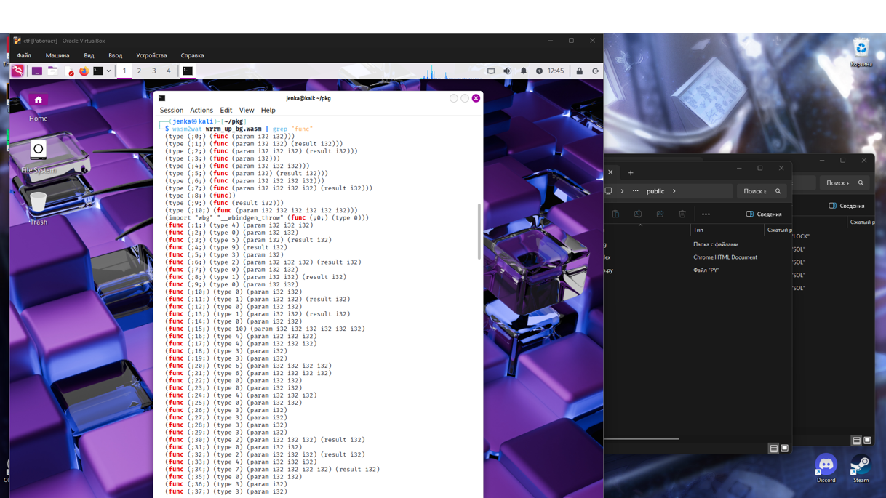

С помощью утилит `wasm2wat` и `strings` извлечем строки, среди которых обнаруживаем фрагмент `[Flag is CyKor{}]`. Далее выполняем поиск по сегменту данных, видны байты с путями исходников и строкой флага, что указывает на то, что нужная информация спрятана в памяти программы.

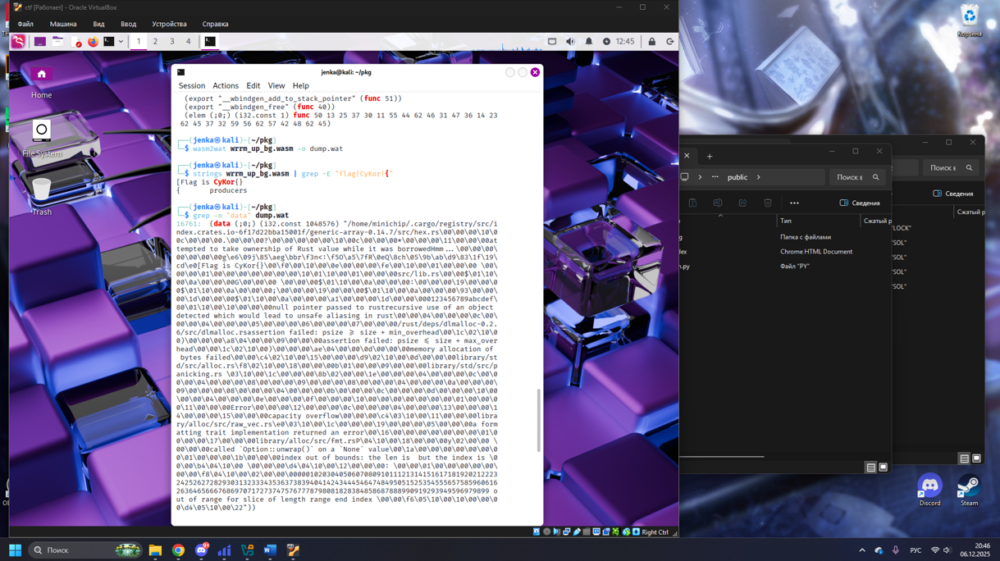

Несмотря на анализ и декомпиляцию модуля, флаг так и не был найден, поскольку он не хранится в открытом виде внутри сегмента данных. Его генерация происходит динамически через выполнение проверок в функции `sudoku_check`, где итоговая строка формируется только при корректном решении судоку, но мне этого сделать не удалось.


