***[XSS - Stockée 1](https://www.root-me.org/fr/Challenges/Web-Client/XSS-Stockee-1)***

---

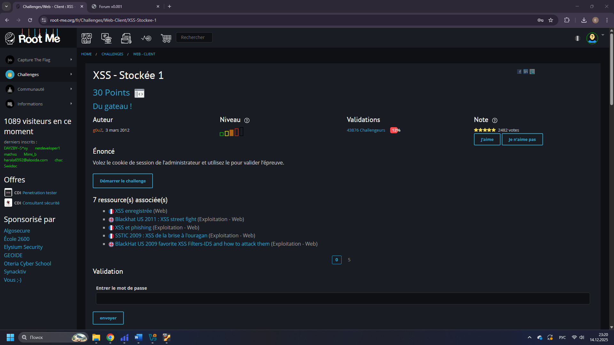

Переходим на страницу форума и видим форму добавления сообщения.

Проверяем наличие XSS, отправляя тестовый payload `` в поле сообщения.

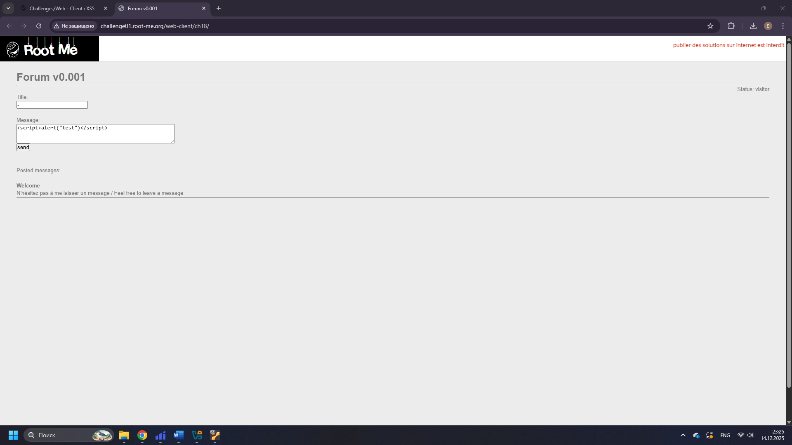

Убеждаемся, что XSS срабатывает.

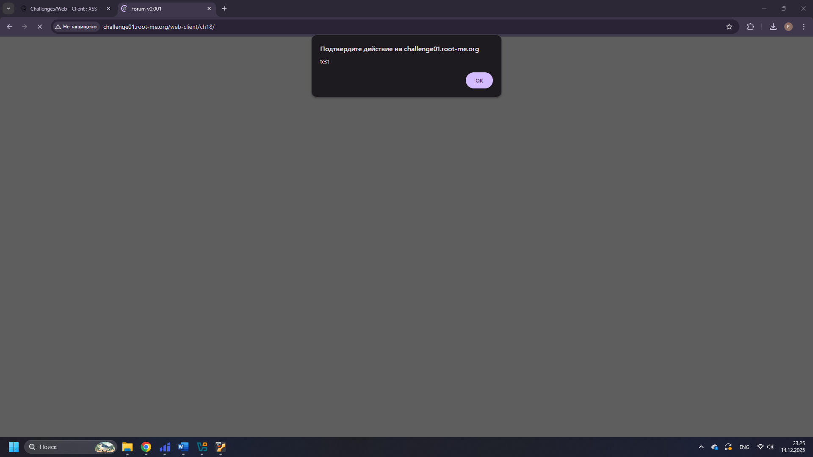

Создаём URL на сервисе webhook.site для перехвата HTTP-запросов с `cookie` администратора.

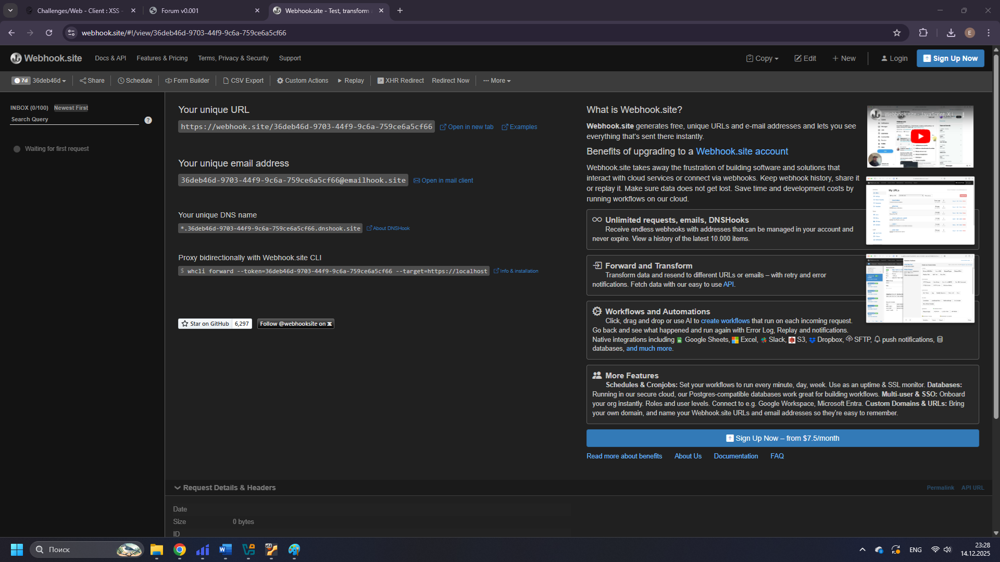

Отправляем XSS-payload, который перенаправляет администратора на webhook.site с его `cookie` в параметрах запроса.

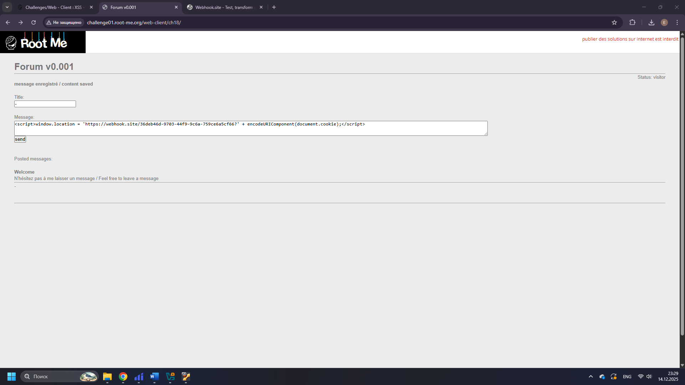

При переходе по payload выполняется запрос на webhook.site.

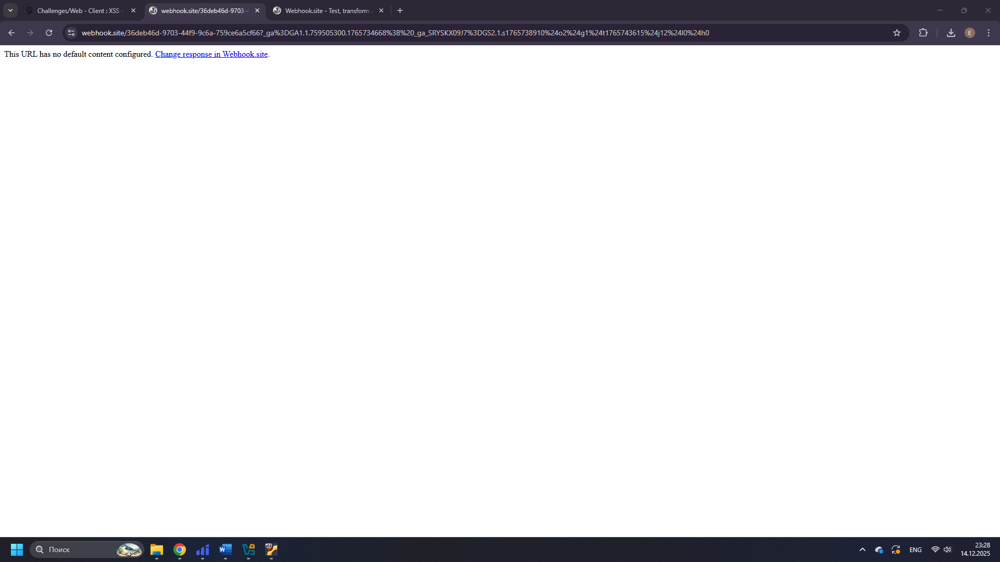

Просматриваем полученный запрос на webhook.site и извлекаем `cookie` администратора.

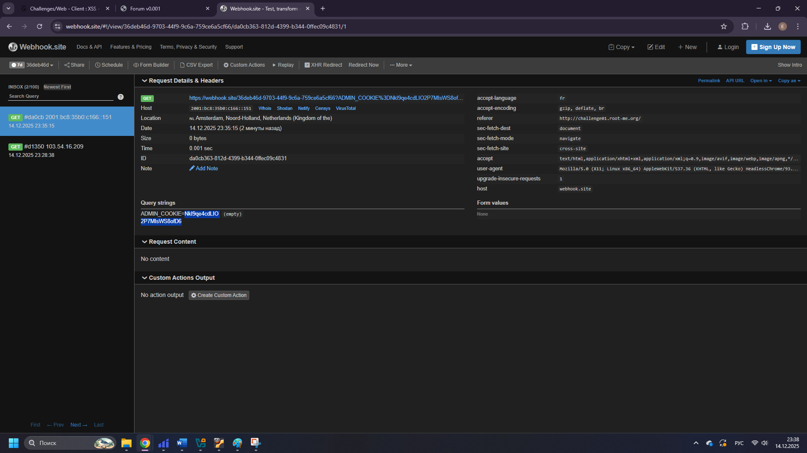

Подставляем полученное значение в поле проверки, задача засчитывается.

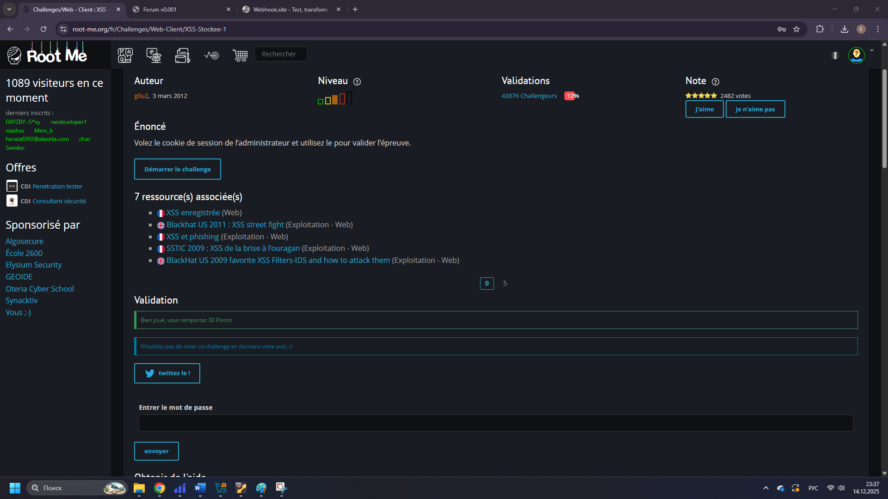

***[Javascript - Obfuscation 3](https://www.root-me.org/fr/Challenges/Web-Client/Javascript-Obfuscation-3)***

---

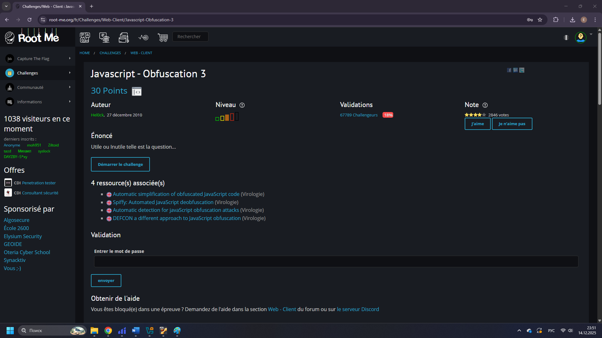

Запускаем задание и видим форму ввода пароля.

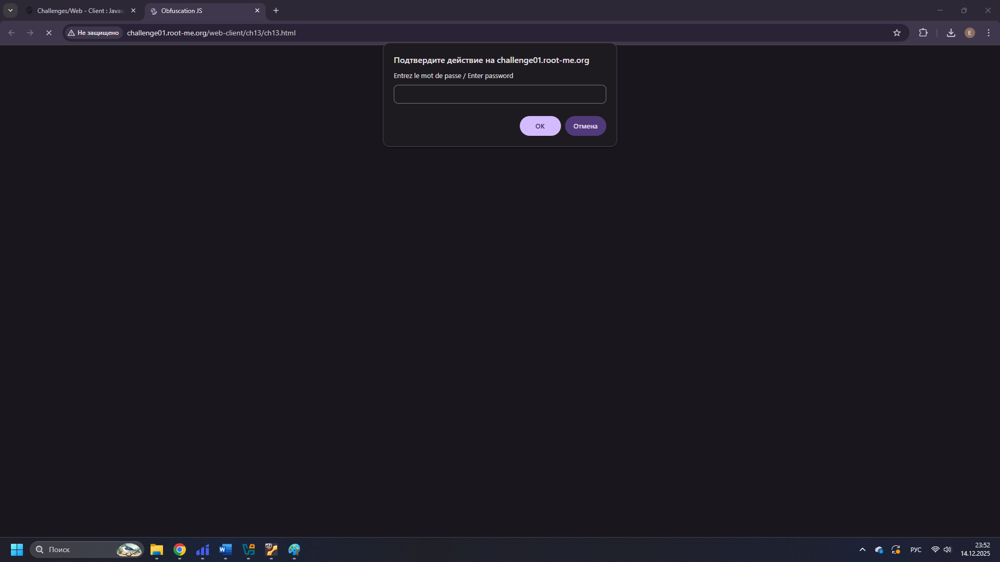

Пробуем ввести произвольное значение и убеждаемся, что при неверном пароле выводится сообщение об ошибке.

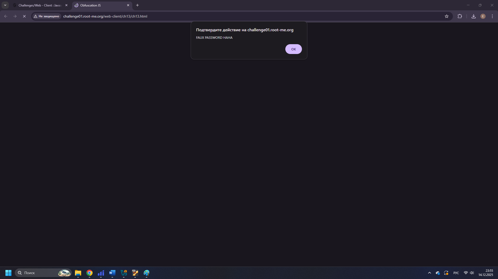

В исходном JavaScript-коде находим участок, где пароль собирается из числовых значений. Сначала задана закодированная последовательность, далее она переводится в символы. Часть символов получается не напрямую, а через перестановку и выбор элементов массива, чтобы усложнить понимание. Берем из скрипта только данные для пароля и ту часть логики, которая преобразует их в текст, и на выходе получаем строку пароля в открытом виде.

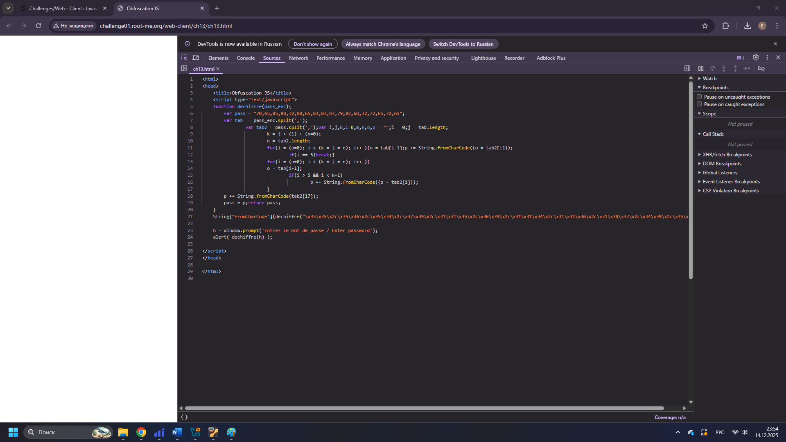

Переносим извлеченную закодированную строку в отдельный код и оставляем только декодирование. Преобразуем каждое число в символ и объединяем символы в одну строку. Таким образом убираем обфускацию и получаем готовый пароль для ввода.

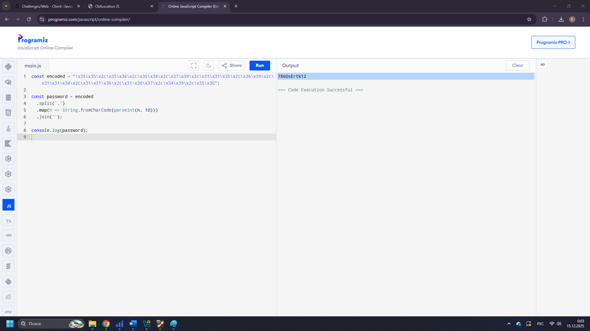

Вводим полученный пароль в форму проверки на странице задания.

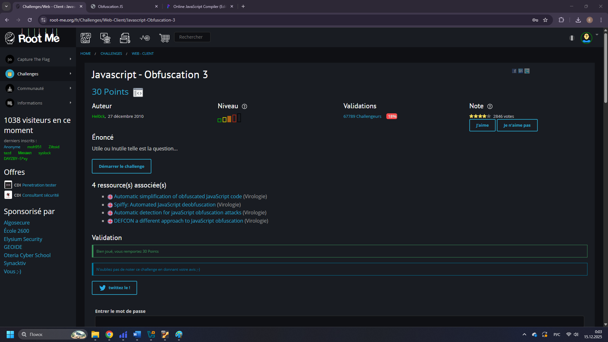
